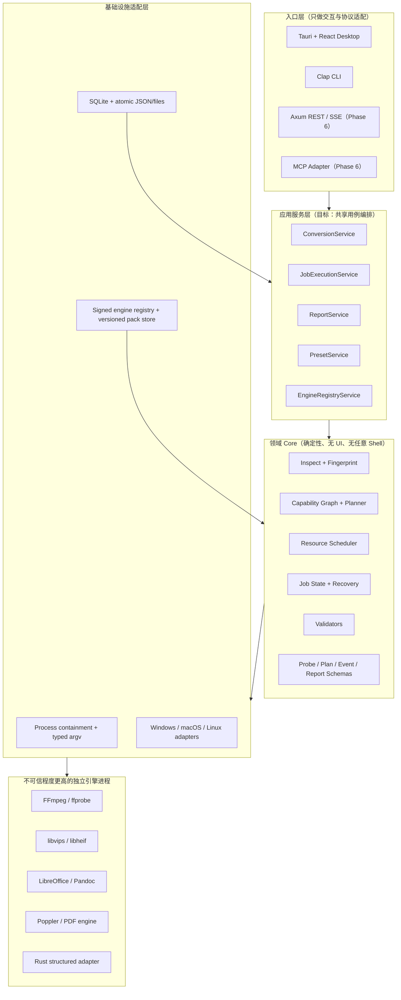
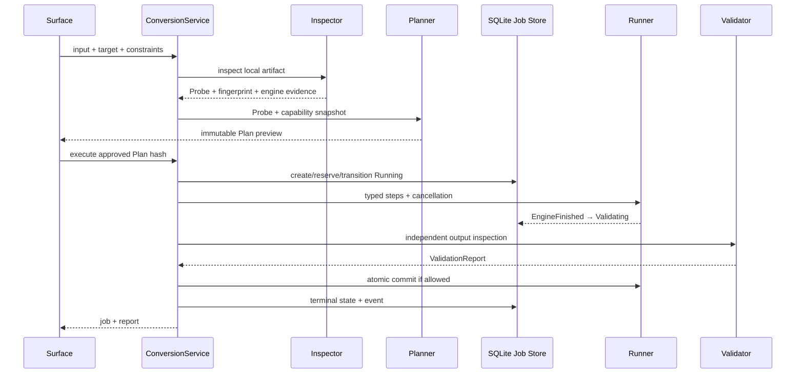

# FormatWright 完成清单、待完成清单与总执行计划

- 状态：持续维护的执行主表
- 版本：0.5
- 更新：2026-08-12
- 产品范围与发布门槛来源：[`SPEC_PLAN.md`](../SPEC_PLAN.md)
- 逐需求证据来源：[`docs/specs/TRACEABILITY.md`](specs/TRACEABILITY.md)
- 活跃缺陷与关闭证据：[`docs/DEFECT_REGISTER.md`](DEFECT_REGISTER.md)

## 1. 文档用途与状态口径

本文回答三个问题：已经完成什么、还欠什么、接下来按什么架构和顺序完成。它不替代产品规格；当本文、追踪矩阵与实现冲突时，以可复现测试和代码为事实，随后同步三份文档。

状态口径：

- **已完成**：代码已落地，并有直接测试或沙箱证据；只对证据覆盖的平台和范围有效。
- **部分完成**：主路径已实现，但缺少完整语料、平台、签名、安全或用户验证，不能宣称 Certified/Public Beta。
- **未开始**：只有规格或方向，没有可运行实现。
- **发布阻断**：不完成就不能发布 Public Beta；不是一般优化项。

当前产品结论：**FormatWright 已具备 Windows 自包含开发候选：Release 内嵌并首次启动安装 PDF/Media Starter，生产只解析激活 pack 的精确路径，UI 与后端共同按 capability snapshot 门控；真实 PDF→PNG/JPG、GIF 与结构化链路已在本机通过；R-001 至 R-007 与 R-010 已关闭；SQLite MaintenanceService、可校验应用状态整包、v4 持久批次/幂等键/稳定 Selection/Bulk Action 审计、共享 ConversionService/ReportService，以及 CLI/Desktop 批量入口已完成；Desktop 已具备启动恢复摘要、精确 partial 清理、SQLite 状态/路径/批次筛选、有界分页，以及与执行互斥的状态/完整性/整包备份/压缩/下次启动恢复中心；四进程原子认领、公平批次窗口、真实强退恢复，以及 10,000 项结构化/图片/媒体混合公平性/P50/P95/RSS/WAL 门禁已通过。** 但这仍不是 Public Beta：R-008/R-009 尚缺离线干净虚拟机、完整引擎 SBOM/许可证与源码义务、可信签名/吊销、升级回滚和正式代码签名证据；Gate 1 尚缺高分辨率/PDF/Office 扩展、长时掉电与跨平台认证，Gate 2–5 仍未完成。不得用于唯一副本或不可替代数据，也不得宣称“已认证”或“正式发布”。

### 1.1 近期进度快照（2026-08-12）

**本轮已完成（有直接证据）：**

- [x] 将 CLI 持久队列执行循环抽取为共享 `JobExecutionService::run_window`（`crates/core/src/application/`）。
- [x] CLI `jobs run` 仅保留参数解析、Ctrl+C 与 JSON/文本输出；调度/状态机/重检/milestone 在 Core。
- [x] 新增 6 项应用层单元测试（完成、资源释放、预取消、blocked 释放槽位、PLAN_INVALID、parallel/limit 边界）。
- [x] Windows 沙箱复跑：`batch-suite-399229570e534915a0277a326529a6d8`、`mixed-scheduler-suite-402efe46745d4aeaa1a1319ea1f0d304`。
- [x] 同步 `TRACEABILITY.md`、`docs/testing/JOB_EXECUTION_SERVICE.md` 与 batch/mixed/durable 证据文档。
- [x] Desktop 接入同一执行器：`queue_desktop_conversion`、`run_desktop_queue_window`、`pause_desktop_queue_window`（finish-current / immediate）、`cancel_desktop_queue_window`；Convert「加入队列」、Jobs「运行 / 完成当前后暂停 / 立即停止」。
- [x] 队列窗口通过 `run_window_observed` 在终态前提交 ValidationReport 文件（Desktop `reports/`）。
- [x] Core `QueueWindowControl`：finish-current 只停准入；immediate 同时取消活跃 worker。
- [x] 2026-08-12 最新验证：160 项普通 Rust 测试、6 项前端测试、TypeScript、生产构建、Rustfmt、Clippy `-D warnings`、Rust 1.88 MSRV、仓库合同与 pnpm production audit（0 已知漏洞）通过；两项 10k release tests 按设计默认忽略，均已有显式 release 运行证据。
- [x] 初次审查确认仓库没有提交；已用验证后的完整快照建立首个可回滚 Git 基线。
- [x] 建立首个 Git 基线 `412c475`；Release/Development 引擎隔离提交 `7782e47`。
- [x] 实现并验证 Release 精确 pack 路径、Windows 脚本包装拒绝、Desktop/Core capability snapshot 双重门控。
- [x] 实现可重复 Windows Starter 构建、运行库哈希、版本化 install、原子 active registry 与首次启动激活；PDF/Media 清单验证通过。
- [x] 真实 15 页 PDF→PNG/JPG、GIF 与结构化 E2E 通过；证据见 `docs/testing/WINDOWS_STARTER.md`。
- [x] 修复 R-010 Poppler 分数像素向上取整不一致；原失败 PDF 的 PNG/JPG 验证均为 Pass。
- [x] 新增共享 `MaintenanceService` 与 CLI `maintenance status|backup|restore|integrity-check|compact`；SQLite online backup、完整性/引用不变量、恢复临时副本 migration preflight、显式事务切换与恢复前安全快照已通过磁盘 E2E。
- [x] `SqliteJobStore::open` 在旧 schema→当前 v4 migration 前自动创建可验证便携快照，自动快照默认保留 5 份；损坏或新版恢复源不会改变 live DB。
- [x] SQLite 所有 mutation 改为 immediate writer transaction；两个独立连接的同输出预约和同任务 transition 竞态各只有一个赢家，事件序列/完整性保持有效。
- [x] 六类输出提交统一使用跨平台 no-clobber publish；文件/目录已存在时原内容不变，晚到冲突稳定返回 `OUTPUT_CONFLICT`。
- [x] SQLite schema v4：持久 Batch、任务幂等键、最多 100,000 项的稳定 Selection Snapshot、逐任务 Bulk Action 审计；v3 migration 前自动快照与计数不变量检查通过。
- [x] CLI `jobs batches|select|selection|bulk` 与 Desktop 筛选后批量 Retry/Resume/Cancel 复用 `BulkJobService`；`batch-images` 返回持久 `batch_id`。
- [x] CLI `convert --queue-only --idempotency-key` 与 Desktop 入队重试使用原子幂等入队；两个独立连接并发重放最终只有一个 Queued Job。
- [x] Core `ConversionService` 与 `ReportService` 统一 CLI/Desktop 即时转换和所有 CLI/Desktop 队列报告；CLI 重复 Planner 已删除，报告在终态前原子持久化。
- [x] `ApplicationStateService`：版本化 manifest、逐成员 SHA-256/路径/大小验证、SQLite+presets+settings+registry identity+可选 reports，恢复前完整 safety bundle 与中断 journal 回滚；CLI 磁盘 E2E 通过。
- [x] 多进程队列所有权：持久批次 round-robin 窗口、`Queued → Inspecting` immediate-transaction 原子认领、`contended` 对账；四个 CLI 进程对 24 项只启动 24 次引擎并生成 24 份输出/报告。
- [x] 真实强退恢复：在 `Running` 且 partial 已写入时定向终止进程树；recover 精确中断 1 项并清理 1 个 partial，resume 后完成、源 hash 不变、独立 ffprobe 通过。
- [x] 10,000 mixed release gate：9,600 JSON→YAML + 200 PNG→WebP + 200 MKV→MP4；首窗口 86/85/85，批次首启差 1.791s，P50/P95 137.533/193.880s，49.762 jobs/s，控制面 RSS 70,877,184、WAL 峰值 48,092,792 bytes；20 个合法格式内容变化逐项确认为 `INPUT_CHANGED`，修复后全部完成，10,000 输出/报告、400 独立 probe、0 partial。

**计划完成（按 Gate 顺序，尚未勾选为完成）：**

| 顺序 | 计划项 | 所属 Gate | 状态 |
|---|---|---|---|
| 1 | 建立首个可回滚 Git 基线、保护分支和缺陷台账 | Gate 0 | 本地基线完成；远端保护待仓库托管 |
| 2 | 关闭 R-008/R-009：Starter 引擎包、Release 精确解析、能力门控、干净机离线真实转换 | Gate U | 实现与本机 E2E 完成；认证/干净机待完成 |
| 3 | 关闭审查 P1：worker 失败收口、Plan hash 批准、报告/终态顺序、immediate pause 可恢复 | Gate 1 | R-001/R-002/R-003/R-004 已关闭 |
| 4 | 补 Windows 路径预约规范化、运行中 pause/failure-injection 测试、取消桥接任务生命周期 | Gate 1 | R-005/R-006 已关闭 |
| 5 | 抽取完整 `ConversionService` 和 `ReportService`；删除入口层重复编排 | Gate 1 | 核心生命周期完成；revalidate/export 归 Gate 2 |
| 6 | Desktop 恢复横幅、批量取消/重试、实时队列读取 | Gate 1 / 2 | 启动恢复摘要、精确 partial 清理、SQLite 路径/状态/批次筛选、有界分页、实时读取/入队与稳定筛选批量动作完成；长列表虚拟化待完成 |
| 7 | 版本化 migration、备份/恢复/完整性检查，形成 Windows 长期自用稳定版 | Gate 1 / 4 | SQLite + 应用状态整包及 Desktop 维护中心完成；干净机升级/回滚待完成 |
| 8 | batch/selection、10k 混合负载、公平性/延迟/RSS/WAL；拆分 `runner.rs` | Gate 1 | batch/selection/bulk、公平窗口、多进程原子认领/强退恢复、10k mixed small-file、no-clobber commit 完成；高分辨率/PDF/Office 扩展与拆分待完成 |
| 9 | Desktop Beta 闭环（文件夹、筛选虚拟化、进度、导出、shell 集成、无障碍） | Gate 2 | 未开始 / 部分 |
| 10 | 引擎签名与格式认证、OS 强制隔离、跨平台、物理 10 GiB | Gate 3 | 未开始 / 部分 |
| 11 | 正式签名包、升级回滚、干净机 | Gate 4 | 未开始 / 部分 |
| 12 | Private/Public Beta 用户验证；之后才开始 API / MCP / 自托管 | Gate 5 / 6 | 未开始 |

外部依赖（负责人决策，工程不得自行假设完成）：见 §15（名称/签名账户/最低 OS/引擎分发/语料许可等）。

## 2. 阶段总览

| 阶段 | 开发状态 | 已有成果 | 未满足的退出条件 |
|---|---|---|---|
| Phase 0 基础 | 已完成 | Monorepo、Apache-2.0、8 个公共 Schema、10 个 ADR、三平台 CI 配置、贡献/安全/隐私文档 | 名称/商标、最低 OS、签名账户等产品决策仍需冻结 |
| Phase 1 架构 Spike | Windows 已完成；跨平台部分完成 | 安全子进程、10 GiB 稀疏文件、partial/原子提交、SQLite 恢复、10k WebView 投影、引擎 Manifest | 物理 10 GiB、macOS/Linux 真实进程树与引擎分发认证 |
| Phase 2 Core + CLI Alpha | Windows 自包含候选完成；认证未完成 | Inspect/Plan/Convert/Batch/Doctor/Jobs/Engines；Starter PDF/Media；能力门控；12 条工作流均有开发环境实验路径 | R-008/R-009 干净机/供应链关闭证据、完整语料与跨平台工作流认证 |
| Phase 3 队列/恢复/质量 | Windows 开发门槛完成；长期认证待补 | 10k 持久/同质/混合真实转换、P50/P95/RSS/WAL/staging、20 项可恢复失败、确定性资源调度、公平批次窗口、多进程原子认领与真实强退恢复、CLI/Desktop 已委托 `JobExecutionService` | 高分辨率/PDF/Office 10k 扩展、长时掉电 soak、跨平台恢复 |
| Phase 4 Desktop Beta | 部分完成 | Tauri/React、双语普通/专家模式、原生选择器、Plan/Jobs/Reports/Doctor、启动恢复横幅与精确 partial 清理、SQLite 状态/路径/批次浏览和分页、持久队列窗口、可恢复 immediate pause、单任务与稳定筛选批量 Resume/Retry/Cancel、引擎导入、可编辑预设 | 文件夹入口、长列表虚拟化、系统右键/Finder/Linux 集成、完整可访问性与可用性 |
| Phase 5 安全与发布 | 部分完成 | fuzz、依赖审计、cargo-deny、SPDX SBOM、零套接字观测、离线 NSIS 安装烟测 | 当前源码重打包、可信签名/吊销、引擎 SBOM、OS 强制隔离、升级回滚、macOS/Linux 包 |
| Phase 6 API/MCP | 未开始 | 规格方向已确定 | Axum、OpenAPI、SSE、Webhook、Worker、目录授权、MCP tools |
| Phase 7 浏览器/企业 | 未开始 | 范围原则已确定 | WASM 小任务、企业策略/SSO/审计/离线升级 |

## 3. 已完成清单

### 3.1 仓库、合同与工程基线

- [x] Rust 2024 workspace：`core`、`engine-sdk`、`cli`、Tauri desktop。
- [x] pnpm workspace、React/TypeScript/Vite 前端与固定包管理器版本。
- [x] Apache-2.0、SECURITY、PRIVACY、CONTRIBUTING、用户指南和故障排查。
- [x] Probe、Plan、JobEvent、ValidationReport、EngineManifest、PresetLibrary、ApplicationStateManifest、ApplicationSettings 八个 JSON Schema v1。
- [x] Rust 实例对公共 Schema 的合同测试，顶层未知字段拒绝。
- [x] ADR-0001 至 ADR-0010：单 Core 多入口、子进程边界、SQLite 恢复、认证引擎包、有界 UI 投影、跨平台进程树、事务式 SQLite 维护、持久批次/Selection/Bulk Action、共享转换/报告生命周期、版本化应用状态整包。
- [x] Windows/Linux/macOS CI 工作流已配置；Linux 额外执行依赖审计、许可证/来源策略、SBOM 和 MSRV 1.88。
- [x] Dependabot、定时 fuzz、手动 unsigned Windows release-candidate workflow。

### 3.2 Core、CLI 与引擎执行

- [x] 内容优先识别与扩展名不一致警告；拒绝远程 URL 和 Windows UNC 输入。
- [x] 版本化 Probe/Plan/Report、稳定错误码、恢复建议和隐私脱敏结构。
- [x] 确定性 Plan：随机 ID、安装路径和输出路径不影响 Plan hash。
- [x] remux 优先、损失分类、轨道/字幕/透明度/结构化映射硬约束。
- [x] 子进程只接收类型化 argv，不执行任意 shell 字符串。
- [x] 超时与取消令牌、Windows 进程树终止、同目录 partial、验证后提交、无静默覆盖。
- [x] FFmpeg/ffprobe、libheif 开发回退、LibreOffice、Pandoc、Poppler 和 Rust 结构化数据路径。
- [x] CLI：inspect、plan、convert、batch-images、doctor、jobs list/show/run/cancel/retry/resume/recover/batches/select/selection/bulk、engine pack verify、maintenance status/backup/restore/integrity-check/compact。
- [x] `convert --queue-only` 将不可变 Plan 持久化后再由队列执行。
- [x] GW-01 至 GW-12 均有 Windows 实验性端到端证据；认证边界见格式矩阵。

### 3.3 持久队列、调度与恢复

- [x] SQLite 任务、事件序列、不可变 Plan、输入指纹和输出预约为持久真相源。
- [x] 合法状态机、终态释放预约、失败/取消重试重新预约、启动时 active → interrupted。
- [x] 10,000 条任务单事务创建、重启后分页读取和 SQL 聚合。
- [x] 10,000 个不同 JSON 输入到 YAML 的真实 Inspect → Plan → Queue → Execute → Validate → Commit 发布门禁通过。
- [x] 单次调度窗口最多 hydrate 256 个任务；真实 10k 门禁使用 128 个有界窗口。
- [x] `--parallel` 限定 1–16；确定性 round-robin 资源准入。
- [x] process、CPU-heavy、I/O-heavy、GPU、内存预算和引擎互斥约束。
- [x] 默认 2 GiB 预约预算；CPU-heavy/LibreOffice 按 1 GiB 保守预约。
- [x] 递归图像批处理保留目录、拒绝目录链接、冲突预约、暂停后跨进程恢复并重检输入/引擎。
- [x] 九任务结构化/图片/视频混合队列观测到两个真实 FFmpeg 进程并发，记录父进程/进程树 RSS 和 WAL 峰值。
- [x] Ctrl+C 停止新任务准入并取消活跃进程树；`Validating → Cancelled` 有回归测试。
- [x] 共享 `JobExecutionService::run_window`：CLI `jobs run` 与 Desktop `run_desktop_queue_window` 已委托；两种 pause 控制、失败收口、启动恢复摘要与单任务 Resume/Retry UI 已接入。
- [x] 共享 `MaintenanceService`：SQLite status、完整性、在线备份、恢复预检/显式恢复、compact、migration 前快照与五份保留；`ApplicationStateService` 负责分散状态整包与 journal 回滚；Desktop 维护中心与转换/队列互斥，恢复经复制后二次预检、大小/BLAKE3 锁定并在下次数据库打开前再次核验执行。
- [x] 所有 SQLite mutation 用 immediate transaction 串行化 writer；独立连接 reservation/transition race 有直接回归；所有输出族使用同一 no-clobber publish primitive。
- [x] 持久 Batch/ordinal membership、任务幂等键、稳定 Selection Snapshot 与 Bulk Action/per-job outcome；CLI/Desktop 共用 `BulkJobService`，图片 batch 写入真实 batch ID。

### 3.4 Desktop

- [x] Tauri 2 调用同一 `formatwright-core::prepare_conversion`，不是前端伪实现。
- [x] Convert、Jobs、Presets、Engines、Reports、Settings 六个主入口。
- [x] 文件拖放、原生输入选择、文件/目录输出选择、推荐格式、非覆盖输出建议。
- [x] 普通/专家模式；显示真实格式、步骤、损失、保留/改变/丢弃/未知和类型化参数。
- [x] 真实转换、取消、持久历史、持久 ValidationReport、Doctor、引擎包版本化复制导入和首次启动 Starter 激活。
- [x] capability snapshot 同时门控推荐、目标选择、预设、预览、执行与队列；后端拒绝绕过 UI 的不可用路线。
- [x] 简体中文/英文、可见焦点、高对比度、减少动画、文字化状态。
- [x] 10,000 任务以批次投影到 WebView，不一次传输全部对象。
- [x] Jobs 路径筛选与批量 Retry/Resume/Cancel：点击时先固化 Selection Snapshot，再按当前状态逐项 transition/skip 并显示审计计数。
- [x] PresetLibrary v1：命名、编辑、应用、两步删除、完整导入校验、JSON 导入/导出、失败原子化合并和可恢复写入。
- [x] Windows 原生 UIA 已验证预设控件命名/焦点、保存、正常关闭、重启持久化、两步删除与测试数据清理。

### 3.5 安全、供应链和打包

- [x] 锁定依赖审计：主 Cargo、fuzz Cargo、pnpm production 当前 0 个已知漏洞。
- [x] `cargo-deny` advisory、ban、license、registry/git source 策略通过。
- [x] 应用 SPDX 2.3 SBOM 生成与引用自校验：527 packages、1571 relationships（最新依赖图口径）。
- [x] EngineManifest 限制平台/架构/协议/兼容版本/相对路径/哈希/许可证；篡改与路径穿越测试通过。
- [x] manifest 与结构化解析 fuzz harness；Windows 有界 campaign 无崩溃；Linux 定时 fuzz 已配置。
- [x] Plan 网络策略硬拒绝；Windows 路径限定进程树 TCP/UDP 观测为零。
- [x] 离线 WebView2 NSIS 已实际构建，完成 SHA-256、沙箱静默安装、原生启动、卸载和零残留检查。
- [x] 新增 scheduler/preset 后的 embedded release executable 已重新构建并通过原生像素/UIA 检查。
- [x] Windows Starter 构建脚本固定 Poppler/FFmpeg 版本与 archive hash；manifest 覆盖 executable/runtime/license 文件，重复构建顶层清单哈希一致。
- [x] Tauri Windows bundle 内嵌 Starter；Release 首次启动验证后复制到版本化 store 并原子激活，ambient `PATH` 不参与生产解析。

### 3.6 当前自动化验证基线

- [x] `cargo fmt --all --check`。
- [x] `cargo clippy --workspace --all-targets --all-features -- -D warnings`。
- [x] 160 项普通 Rust 测试通过（134 Core、9 Schema、13 Desktop、4 Engine SDK）；另有 2 项昂贵的 10k 同质/混合发布测试按设计默认忽略，均有显式 release 运行证据。
- [x] 6 项前端测试、TypeScript check 和生产构建通过。
- [x] Rust 1.88 MSRV 全 workspace locked check 通过。
- [x] 8 个 Schema、12 个黄金工作流和必需文件的仓库合同检查通过。
- [x] 图片、HEIC、音频、GIF、媒体、元数据、结构化、文档、PDF、Office、批量、混合调度、大文件、零网络和预设沙箱已有可复现脚本/文档。

## 4. 待完成清单

### 4.1 P0：Public Beta 发布阻断

- [ ] **Windows 开箱可用纵向闭环**：确定版本、内嵌资源、本机首次启动安装和 Core/PDF/Media E2E 已完成；仍须在没有 FFmpeg、Poppler、LibreOffice、Pandoc、libvips 和开发缓存的离线干净虚拟机中通过安装后 UI 转换，并完成 Starter 供应链认证。
- [x] **生产引擎解析与能力门控（实现）**：Release 只运行已激活 pack 中的精确二进制路径，禁止 ambient `PATH`、`.cmd`、`.bat`；UI/Planner/Backend 只展示和接受当前 capability snapshot 确实可执行的路线。R-009 关闭仍等待 Gate U 干净机证据。
- [ ] **冻结产品决策**：名称/商标与域名、最低 OS、签名账户与预算、官方引擎包选择策略、PDF 默认引擎、测试语料许可证、AGPL 服务仓库边界。
- [ ] **可信引擎供应链**：正式 release keyring、签名验证、密钥轮换/吊销、每个引擎的 SBOM/源码/构建 flags/许可证和认证记录。
- [ ] **完整验证闭环**：每个对外支持的工作流都有类型专用必检项；Unknown 不计为 Pass；完成 Office/PDF 视觉差异阈值校准。
- [ ] **三平台真实认证**：Windows 11、macOS arm64（及 x64 构建）、Ubuntu LTS 跑黄金语料、取消/进程树、Unicode/长路径、文件系统和离线门禁。
- [ ] **OS 强制隔离**：Windows/macOS/Linux 上用可验证的系统机制阻断引擎网络与越权文件访问，而不只做套接字观测。
- [ ] **正式发布包**：基于最终源码重新构建 Windows NSIS 并签名；macOS 签名/公证；Linux AppImage/包；附 SBOM、哈希、许可证。
- [ ] **升级/回滚/干净机**：旧版本升级、数据库/预设迁移、失败回滚、离线安装、卸载和干净虚拟机验证。
- [ ] **P0/P1 清零机制**：建立缺陷台账与严重度，完成发布审计；目前没有足够外部测试证据宣称“无 P0/P1”。

### 4.2 P1：Core、队列与验证

- [x] 将 CLI 的队列执行循环抽成共享 `JobExecutionService`（`crates/core/src/application/job_execution.rs`）；CLI `jobs run` 与 Desktop 队列窗口已委托，两种 pause、队列报告落盘、失败收口和单任务恢复/重试已接入；恢复横幅与批量动作仍未完成。
- [x] **R-001 worker 失败收口**：任何 prepare、milestone、report callback、terminal transition 或 join 失败都会先停止准入、取消并 drain 活跃 worker，将未完成任务转为 `Interrupted / CONTROL_PLANE_FAILED`，释放调度资源后再返回原错误；报告存储失败和 worker panic 双 worker 故障注入通过。
- [x] **R-002 Plan 批准边界**：Desktop 分离式预览的执行与入队必须提交已预览的 `plan_hash`；Core 重新检查输入/引擎后仅在 hash 相同才执行，缺失批准或发生变化均拒绝。CLI 单命令转换把参数提交与执行视为同一次显式批准；未来 API/MCP 必须复用相同 Core 合同。
- [x] **R-003 Report/终态一致性**：立即转换与队列统一为“输出验证并提交 → 报告原子持久化 → SQLite 终态”；报告失败时即时任务进入 `Interrupted / REPORT_PERSIST_FAILED`，已有报告可原子替换并从中断 backup 恢复。
- [x] **R-004 pause/retry 语义**：finish-current 完成活跃项；immediate 停止准入并把活跃步骤记为 `Interrupted / QUEUE_PAUSED_IMMEDIATE`，未准入项保持 Queued；Desktop 对 interrupted/blocked 提供 Resume，对 failed/cancelled 提供 Retry，下一队列窗口重检后继续。
- [x] **R-005 Windows 输出身份**：预约与提交共用输出身份解析；大小写、`\?\`/8.3、`.`/`..`、最深已存在 reparse 祖先和不存在父目录归一，尾随点/空格、保留设备名、ADS、UNC/设备 namespace 拒绝；执行前重检，link retarget 进入 `Blocked / OUTPUT_IDENTITY_CHANGED`；v3 migration 原子重建旧预约。
- [x] **R-006 长生命周期与取消收口**：`run_window` 用结构化 `select` 取代悬挂 cancellation linker；64 窗口 task 计数、两种运行中 pause、外部取消 drain、report/SQLite failure、worker panic 与 Windows 真实父子进程树/partial 清理均有回归。锁 poison、窗口关闭和进程强退的 Desktop 端到端恢复继续归入 Gate 2。
- [x] **R-007 Desktop 实时队列访问**：队列窗口使用独立 WAL/busy-timeout 连接，UI 保留短事务连接；窗口运行中 list/paging/queue-only 并发回归通过，新任务留待下一窗口；RAII lease 防止双 runner 并在所有退出路径清除控制状态。
- [x] SQLite 多连接并发预约/transition/queue claim 竞态：mutation 使用 immediate writer transaction + 5 秒 busy timeout；同输出、同 transition 与同 queued Job 都只有一个赢家。四进程 24 项 exact-once 和一次真实 kill/recover/resume 已通过；长时掉电 soak 仍归 release evidence。
- [x] 任务级幂等 key、批次模型、稳定 selection query 和批量动作审计；schema v4、v3 自动快照、Core/CLI/Desktop 与完整性不变量有直接证据。
- [x] immediate pause 的运行中恢复语义与未准入保持 queued 已有回归；finish-current 的真正运行中时序与更长生命周期/真实子进程断言归入 R-006。
- [x] 10,000 混合图片/媒体/数据 small-file 负载：记录吞吐、公平性、P50/P95 队列延迟、RSS、临时空间、DB/WAL，并注入/恢复 20 个输入变化；高分辨率及 PDF/Office/document 扩展仍待认证。
- [ ] 真实物理 10 GiB 顺序读写门禁、低内存机器、磁盘满、权限丢失、目标卷消失和 removable drive。
- [ ] 目的路径在验证后、提交前被外部创建的竞态测试；目录输出多文件提交恢复。
- [ ] 完整命令注入/特殊字符语料：引号、换行、Unicode、RTL、保留名、长路径、设备路径、恶意 metadata。
- [ ] 将当前超大的 `runner.rs` 按引擎 adapter 和 commit/process boundary 拆分，同时不改变公共 Plan 合同。
- [ ] 补 scheduler/preset ADR，记录资源预约是保守估算而非 OS 内存硬限制。

### 4.3 P1：Desktop Beta

- [ ] 文件夹作为一等输入，展示枚举/跳过/目录映射预览。
- [x] 桌面真正执行持久队列：队列级开始、finish-current pause、可恢复 immediate pause、启动恢复摘要，以及单任务和筛选后的批量 Resume/Retry/Cancel 已落地。
- [ ] 状态筛选、搜索、分页/虚拟化、稳定选择、批量重试失败项、跳过完成项：SQLite 路径/状态/批次筛选、有界分页、稳定选择和批量动作已完成；只剩超长列表虚拟化。
- [ ] “仅重新验证”、导出 Plan/任务配方/ValidationReport、打开输出目录、partial 清理入口。
- [ ] 逐阶段进度、速度、ETA 置信度和调度原因；不伪造引擎无法提供的百分比。
- [x] 启动恢复横幅：展示启动中断恢复数、精确 staging 清理数、各持久状态与可恢复总数；可直接进入按状态/批次筛选的任务页处理。
- [ ] 密码/秘密专用提示，不写入 Plan、日志、SQLite、历史或报告。
- [ ] 临时空间/输出空间预检与硬阻断；支持更换目标路径。
- [ ] Windows Explorer 右键菜单；macOS Finder Quick Action；Linux file-manager action。
- [ ] 全键盘工作流、Narrator/VoiceOver/Orca 屏幕阅读器、高 DPI、200% zoom、RTL 文件名、对比度和 reduced-motion 测试。
- [ ] 24 人 Beta 可用性计划；80% 三分钟首次成功、Plan/Warning 理解率和恢复任务目标。

### 4.4 P1：引擎和格式认证

- [ ] **R-008 自包含交付**：设计 Core/Media/PDF/Document/Image 分包；先交付 Windows Starter（Core + PDF + 一条媒体路径），生成 manifest、hash、许可证、来源与版本锁定，并在安装/首次启动/升级/回滚时验证。
- [ ] **R-009 确定性定位**：生产 `EngineLocator` 只接受激活 registry 的精确路径；环境变量和 `PATH` 只允许显式开发模式或“导入候选”发现，候选在执行前必须复制/登记并完成身份校验。
- [ ] **能力驱动 UI**：Doctor 生成 capability snapshot；推荐格式、目标下拉框、Plan 和执行后端使用同一快照。缺少引擎时禁用路线、说明缺哪个 pack，并提供“导入离线包/打开引擎页”，不显示全局陈旧错误冒充任务错误。
- [ ] Windows 官方 libvips 包及 HEVC/HEIF 解码能力；移除“libheif 开发回退”作为认证依赖。
- [ ] FFmpeg multitrack、字幕/章节、HDR/色彩、旋转、VFR、声道布局和 metadata 完整语料。
- [ ] 图片 ICC/EXIF/方向/Alpha/位深/动画语料；AVIF/WebP/JPEG/PNG 质量与尺寸阈值。
- [ ] PDF 加密、透明度、页面选择、字体、表单、文本可提取性和多页大文件语料。
- [ ] Office 字体缺失、宏、外链、公式、动画/对象、复杂分页与跨平台渲染差异。
- [ ] 结构化数据 encoding/date/decimal/null/nesting/flatten mapping 和超大记录集。
- [ ] GW-12 从媒体 slice 扩展到图片/PDF/文档的类型专用 metadata 清理。

### 4.5 P2：工程效率和维护

- [ ] 建立首个 Git 基线提交、`main` 保护、短分支/小提交、Conventional Commits 或等价约定；每个修复能独立回滚。
- [ ] CI 上传测试摘要、SBOM、校验和和失败沙箱证据；重型门禁使用可追溯 nightly/release workflow。
- [ ] Cargo duplicate dependency 定期收敛；记录无法消除的 Tauri 平台依赖。
- [ ] 版本化 SQLite migration、Preset migration 和 engine registry migration 的前后兼容测试。
- [ ] 可复现 fixture 生成、许可证清单、hash manifest 和外部贡献样本流程。
- [ ] changelog、迁移说明、issue/bug/RFC 模板、支持矩阵自动校验。
- [ ] 本地显式导出的诊断包：默认脱敏，用户预览后才写出，不含内容和 metadata value。
- [x] `MaintenanceService` 与 CLI/Desktop：`status|backup|restore|integrity-check|compact|bundle-backup|bundle-restore`；SQLite migration 前自动快照，应用状态整包恢复先做逐成员与数据库预检，再以 journal 协调切换；Desktop 恢复在下次启动、数据库打开前执行并回报成功/失败。

### 4.6 Phase 6/7：Beta 后能力

- [ ] Axum REST API、OpenAPI、SSE、Webhook 和单机 Worker。
- [ ] 授权目录 allowlist、租户/令牌、配额、资源限制、审计和安全默认值。
- [ ] MCP Adapter：inspect/plan/execute/get/cancel/report；execute 必须引用已审阅 Plan，覆盖/有损需确认。
- [ ] Docker 单机部署、健康检查、持久卷、无特权运行、网络策略和升级备份。
- [ ] 小型图片/数据工作流 WASM；大媒体/Office 始终转交可信本地 Worker。
- [ ] 企业策略签名、引擎白名单、SSO、集中审计和离线升级；只有单机瓶颈被证实时再做分布式队列。

## 5. 目标架构

### 5.1 系统分层与依赖方向

依赖规则：

1. UI、CLI、API、MCP 不直接拼引擎参数，不直接修改任务状态。
2. 应用服务只调用 Core 公共用例；同一请求必须生成等价 Plan。
3. Core 不依赖 Tauri、Axum 或某个 UI 框架。
4. 引擎是受约束的外部进程，不可信输出必须重新 Inspect/Validate。
5. SQLite 和持久事件是任务真相源；WebView/SSE 只是有界投影。
6. 输出只有在验证通过且冲突再次检查后才能从 partial 原子提交。
7. Release 只执行已激活、身份已验证的 engine pack 精确路径；系统 `PATH` 和脚本包装器不是生产依赖。
8. UI 展示的可选/推荐路线必须是 Planner 对当前 capability snapshot 的真实投影；后端对缺失能力再次硬拒绝。

### 5.2 不变量

- 相同 Probe、目标和约束生成相同 Plan hash。
- 每个执行步骤绑定 engine ID、版本、binary SHA-256、manifest SHA-256 和能力 ID。
- Plan 的 `network_policy` 默认且必须为 Deny；远程 URL 不进入 v0.1 数据面。
- 所有路径进入 Core 前规范化/授权；不把路径插入 shell 字符串。
- 成功状态必须有已提交输出与 ValidationReport；引擎 exit 0 不等于成功。
- Existing destination 永不静默覆盖；覆盖策略即使未来开放也必须显式、事务化、可审计。
- 队列状态转换与事件写入在同一 SQLite 事务；UI 事件不能成为状态源。
- 用户秘密不进入持久模型、日志、命令预览或报告。

## 6. 各模块设计

### 6.1 Core 领域模块

| 模块 | 当前路径 | 职责 | 输入 → 输出 | 关键约束 | 后续设计 |
|---|---|---|---|---|---|
| Domain/Error | `crates/core/src/domain.rs`, `error.rs` | 公共模型、状态、错误码 | typed request/state → typed object/error | Schema/version 稳定；人类文案不作 API | 增加 Batch、SelectionQuery、PauseMode、SecretHandle |
| Artifact Identity | `fingerprint.rs` | 路径策略、大小/mtime、采样/全量 hash | local path → ArtifactIdentity | 拒绝 URL/UNC；大文件不全量读入内存 | 授权根、placeholder/removable 检测、TOCTOU 强化 |
| Inspect | `inspect.rs`, `document.rs`, `office.rs`, `pdf.rs`, `structured.rs` | 内容优先探测与归一化 Probe | path + inspector identity → Probe | 扩展名只作证据；解析有界 | 将各文件族 inspector 统一到 typed adapter 接口 |
| Engine SDK/Pack | `crates/engine-sdk`, `engine_pack.rs`, `doctor.rs` | Manifest、能力、身份、Doctor、包安装/激活/回滚 | pack/path → verified identity/capability snapshot | 规范相对路径、hash、license、平台/协议；Release 不信任 PATH | versioned pack store、keyring、签名/吊销、SBOM、能力门控与认证记录 |
| Planner | `planner.rs`, `workflow.rs` | 能力图、约束求解、确定性步骤、损失说明 | Probe + PlanRequest + capabilities → Plan | remux/lossless 优先；硬约束不可降级 | 统一所有 adapter path，加入成本/临时空间置信度 |
| Scheduler | `scheduler.rs` | 有界并发和资源准入 | Plan → ResourceRequest → admission/release | 1–16 process、2 GiB 预约、class/GPU/互斥 | 配置化 policy、fair queue、低内存/磁盘背压 |
| Runner | `runner.rs` | typed argv、工作目录、进程树、执行、partial/commit | Probe + immutable Plan + token → result/report | 不走 shell；取消后清理；网络 Deny | 拆为 process boundary、commit service、各 engine adapter |
| Validation | `validation.rs` 及文件族 runner/adapter | 独立重检、规则聚合、Pass/Warning/Fail/Unknown | input Probe + Plan + output → ValidationReport | Required Unknown 不得当 Pass | 每类 validator registry、visual diff、validation-only use case |
| Job Store | `job_store.rs` | SQLite schema、任务/事件/预约/分页/恢复 | use-case command → transactional JobRecord/Event | 单调 sequence、合法迁移、预约唯一 | Batch 表、selection query、多连接竞态、migration versions |
| Preset | `preset.rs` | portable v1 typed preset library | validated JSON/current settings → library | ≤1 MiB import、≤4096、无路径/秘密/shell | 版本迁移、CLI/API surface、可选签名 bundle |

### 6.2 应用服务层（下一步必须抽取）

当前 CLI 与 Desktop 队列窗口均通过共享 `JobExecutionService::run_window` 执行持久队列；Desktop 仍保留单任务立即执行路径。为避免 API/MCP 再复制逻辑，继续在 `crates/core/src/application/` 内形成共享用例；只有依赖边界明显后再拆独立 crate。

| 服务 | 公共用例 | 事务/并发责任 | 调用者 |
|---|---|---|---|
| `ConversionService` | inspect、preview_plan、execute_now、queue_only | 生成/校验不可变 Plan；立即执行也写任务与报告 | CLI、Desktop、API、MCP |
| `JobExecutionService` | run_window（已落地）；pause、resume、cancel、retry、recover 仍由 store/CLI/Desktop 动作组合 | 唯一调度循环；中心化 SQLite milestone；资源 release 必达 | CLI（已接）；Desktop 队列窗口（已接）；Worker（待接） |
| `BatchService` | enumerate、preview_mapping、reserve_all、enqueue_selection | 目录边界、符号链接、命名模板、批量事务 | CLI、Desktop、API |
| `ReportService` | get、revalidate、export_redacted | 报告原子保存、脱敏、validation-only | 全入口 |
| `EngineRegistryService` | doctor、install/import、activate、rollback、revoke、list、capability_snapshot | keyring、hash 重验、版本化 pack store、原子切换 | Desktop、CLI、API |
| `PresetService` | list、save、delete、import、export | 失败原子化、schema migration | Desktop、CLI/API 后续 |
| `MaintenanceService` | status、backup、restore、integrity_check、compact、migration_preflight | 单 writer 协调、升级前快照、恢复验证、保留策略 | CLI、Desktop、Worker |

应用服务必须接收显式 `AuthorizedRoots`、`NetworkPolicy`、`OverwritePolicy`、`ResourcePolicy` 和 `CancellationToken`，禁止读取隐式全局策略后悄悄改变行为。

### 6.3 Engine adapter 设计

目标目录：

~~~text
crates/core/src/engines/
  ffmpeg.rs       media/audio/video/GIF/metadata typed arguments
  image.rs        libvips primary, libheif/FFmpeg experimental fallback
  office.rs       isolated LibreOffice profile
  pandoc.rs       Markdown/HTML to intermediate document
  poppler.rs      PDF info/render validation
  structured.rs   native Rust parser/serializer
~~~

每个 adapter 必须实现同一概念边界：

1. `inspect_capabilities(identity)`：只把运行时可证明能力与 Manifest 取交集。
2. `supports(probe, target, constraints)`：返回支持/阻断原因，不直接执行。
3. `plan(...)`：产生 typed `PlanStep` 与 validator 列表。
4. `execute(step, sandbox, cancellation)`：只接受已验证步骤，不重新解释 UI 字符串。
5. `collect_evidence(...)`：保存版本、hash、stderr 摘要和脱敏诊断。

adapter 不拥有 Job 状态机、不直接提交最终输出、不决定全局重试策略。

### 6.4 引擎分发、定位与能力门控

Windows-first 的 pack 分层如下；每个 pack 都是独立、版本化、可校验和可回滚的供应链单元，不把“本机碰巧安装了某工具”当产品能力：

| Pack | v0.1 内容 | 首批状态 | 典型路线 |
|---|---|---|---|
| Core | Rust 原生结构化 adapter | 内置 | JSON/CSV/YAML/XML |
| PDF | `pdfinfo`、`pdftoppm` 及所需运行库 | Starter 必须 | PDF→PNG/JPG、PDF 验证 |
| Media | `ffmpeg`、`ffprobe` 的已审查构建 | Starter 必须 | 图片基础路线、视频/音频/GIF |
| Document | Pandoc、LibreOffice 与配套 PDF 验证能力 | 可选，认证后启用 | Office/Markdown/HTML→PDF/DOCX |
| Image | libvips/libheif 与 codec 运行库 | 可选，认证后启用 | HEIC、AVIF/WebP 高质量路线 |

安装与解析设计：

1. 构建阶段生成 pack manifest、文件 SHA-256、来源、许可证、构建参数和 SBOM；Release 构建只接受锁定 manifest。
2. 安装包可内嵌 Starter pack，或随安装介质提供同版本离线 pack；首次启动将其原子安装到应用数据目录的 `engines/<pack>/<version>/`，校验成功后切换 `active` 引用。
3. `EngineLocator` 的生产顺序固定为“激活 registry → 精确二进制相对路径”；找不到即返回 `ENGINE_MISSING`，不得继续搜索 `PATH`，不得执行 `.cmd`/`.bat`。
4. 开发版可用显式 dev flag 读取环境变量/PATH；发现到的外部程序只作为导入候选，必须登记身份后才进入正式 capability snapshot。
5. Doctor 将 manifest 能力与实际版本/codec probe 取交集并缓存带 identity 的快照；Planner、推荐格式和后端执行共同消费该快照。
6. 缺失/损坏/撤销 pack 时，相关路线在 UI 禁用并给出明确修复动作；已有 Plan 的 engine identity 变化必须要求重新预览和批准。

### 6.5 Surface 模块

| Surface | 当前/目标结构 | 只负责 | 不得负责 |
|---|---|---|---|
| CLI | `crates/cli` | 参数解析、稳定 JSON/stdout、退出码、Ctrl+C | 自己实现另一套 Plan/验证/调度策略 |
| Desktop backend | `apps/desktop/src-tauri` | IPC DTO、窗口事件、原生 picker/menu、应用目录 | 在 Tauri command 内复制业务状态机 |
| React UI | `apps/desktop/src` | 可访问交互、分页投影、本地化、用户确认 | 认定格式、拼命令、伪造进度、持久真相 |
| REST API | `services/api`（计划） | HTTP auth、DTO、OpenAPI、SSE/Webhook | 绕过目录授权、允许任意本机路径/shell |
| MCP | `adapters/mcp`（计划） | 工具 schema、Plan 审阅/确认、任务查询 | 单步“任意转换”或隐式覆盖 |

### 6.6 平台适配

统一抽象 `ProcessContainment`、`AtomicCommit`、`FreeSpaceProbe`、`ShellIntegration` 和 `EngineLocator`：

| 平台 | 进程控制 | 发布 | 系统集成 | 必测文件系统行为 |
|---|---|---|---|---|
| Windows | Job Object、Ctrl+C/Terminate fallback | Authenticode + offline NSIS | Explorer command/modern menu strategy | NTFS 大小写、保留名、extended path、removable |
| macOS | process group、hardened runtime sandbox | codesign + notarization + DMG | Finder Quick Action | APFS 默认/大小写敏感、translocation |
| Linux | process group/cgroup 可选 | AppImage + checksum/signature | `.desktop`/file-manager action | ext4、Wayland/X11、无特权运行 |

## 7. 关键数据流

### 7.1 单任务

### 7.2 持久队列

公平窗口以持久 batch 为 lane、以 ordinal 为 lane 内顺序；非批次任务共享 interactive lane。查询先取每个 lane 的第 1 项，再取第 2 项，并以创建时间/ID 稳定打破平局；随后资源调度执行 fit scanning。执行前必须原子认领 `Queued → Inspecting`，竞争失败只计 `contended`。任何任务暂时不适合资源预算时，不应阻塞其后的轻任务；暂停只改变准入资格，不能篡改已提交结果。

### 7.3 恢复

- 启动时 `running/validating → interrupted`，从不推断成功。
- 扫描精确 job ID 的 staged output；只清理可证明属于该任务的 partial。
- resume/retry 前重检输入指纹、引擎 identity、输出预约和目标冲突。
- 已完成项不重复；当前文件按策略重启；未来 validation-only 不重做引擎步骤。

## 8. 数据与存储设计

| 数据 | 当前介质 | 一致性 | 保留/隐私 |
|---|---|---|---|
| Job/Plan/Event/Reservation | `jobs.sqlite3` | 事务、WAL、事件 sequence | 默认记录路径但不记录内容；未来可配置路径脱敏 |
| ValidationReport | `reports/{job_id}.json` | same-dir partial + rename | metadata values 默认脱敏；导出前预览 |
| Presets | `presets.json` | partial + recoverable backup | 无输入/输出路径、无秘密、无 shell |
| Engine registry | `engine-registry/{engine_id}.json` | 每个 engine ID 一个 active 指针；原子替换；启动重验 | 保存已安装 manifest 的精确路径与 engine ID |
| Engine pack | 独立目录/离线包 | manifest/hash/signature/SBOM | 不与应用 SBOM 混淆 |
| Output | 用户目标同卷 partial | 验证后冲突复检与 rename | 失败不伪装成最终输出 |
| Local evidence | `.artifacts/` | 测试生成、Git ignore | 发布只附脱敏摘要/hash |

SQLite v4 已实现 `batches`、`batch_members`、`selection_snapshots` 与幂等/批量审计；`job_dependencies` 和通用 migration registry 仍待后续。产品继续保持 SQLite 单机架构，不引入 Redis/Postgres；多进程执行通过数据库 immediate writer 与原子状态认领协调，Maintenance 仍需独占入口，不把它误称为分布式 lease。

## 9. 安全架构

### 9.1 信任边界

从低到高：外部文件/metadata、第三方引擎输出、引擎二进制、引擎 Manifest、Core 规则、用户显式确认。Manifest 声明不是证明，必须与 binary hash、runtime Doctor 和认证记录交叉验证。

### 9.2 分层控制

1. **输入**：本地授权根、协议白名单、路径规范化、符号链接/placeholder 策略、格式内容探测。
2. **规划**：能力交集、硬约束、损失显式化、network deny、临时空间估算。
3. **执行**：typed argv、独立工作目录、最小环境、进程树、CPU/内存/时限、OS 网络/文件隔离。
4. **输出**：独立重检、required validator、partial、冲突复检、原子提交。
5. **供应链**：锁文件、RustSec/npm audit、cargo-deny、应用/引擎 SBOM、签名/吊销。
6. **诊断**：无默认遥测；路径/metadata/secret 脱敏；用户预览后显式导出。

## 10. REST 与 MCP 设计（Phase 6）

### 10.1 REST

建议资源：

- `POST /v1/inspections`
- `POST /v1/plans`
- `POST /v1/jobs`
- `GET /v1/jobs/{id}`、`GET /v1/jobs?state=&cursor=`
- `POST /v1/jobs/{id}:cancel|pause|resume|retry|revalidate`
- `GET /v1/jobs/{id}/events`（SSE）
- `GET /v1/jobs/{id}/report`
- `GET /v1/engines`、`GET /v1/health`

API 不直接接受宿主任意路径。请求引用预先授权的 workspace/root 与相对路径；创建 job 必须提交 `plan_hash`。Webhook 使用签名、重试和幂等 ID，不包含默认未脱敏路径。

### 10.2 MCP

建议 tools：`inspect_file`、`plan_conversion`、`queue_conversion`、`execute_plan`、`get_job`、`cancel_job`、`get_validation_report`。`execute_plan` 只能执行服务端保存且身份未变化的 Plan；有损、丢轨、覆盖或越界路径必须产生显式 confirmation requirement。MCP 永不暴露 `run_shell` 或任意引擎参数模板。

## 11. 执行计划清单

以下工期按 1 名熟悉 Rust/Tauri 的全职开发者估算，不含签名账户审核、外部法务、硬件采购和 Beta 招募等待时间。

### Gate 0：状态、仓库与架构收口（1–3 天）

- [x] 生成本文，区分 Windows 开发完成与发布认证完成。
- [x] 创建首个 Git 基线提交；确认忽略规则不包含源码/配置，并开始使用可回滚的小提交；远端 `main` 保护待托管后配置。
- [x] 建立 `docs/DEFECT_REGISTER.md`，录入 R-001 至 R-010；owner、修复提交和关闭证据在执行时填写。
- [ ] 修正全部追踪矩阵旧描述，逐条关联最新 preset/scheduler/security 证据。
- [ ] 补独立的确定性资源调度与 PresetLibrary ADR；ADR-0008 至 ADR-0010 已分别用于批量审计、共享转换/报告、应用状态整包。
- [ ] 冻结最低 OS、引擎分发和签名/许可证决策。
- [ ] 将 release checklist 拆成可执行 issue，并指定 evidence artifact 名称。

退出：文档不存在互相冲突的完成声明；所有 P0 都有 owner/证据路径。

### Gate U：Windows 真正可用纵向闭环（3–7 天）

- [ ] 冻结 Windows Starter pack：Core + PDF + Media；完成每个二进制与运行库的再分发/许可证审查，无法合法捆绑的能力不得进入 Starter 宣传。
- [ ] 建立确定性 pack builder/stager：manifest、SHA-256、来源、许可证、版本锁与 Tauri/NSIS 内嵌已完成；完整 transitive SBOM/许可证审查仍待完成。
- [ ] 实现版本化 pack store、原子 install/activate/rollback：install/activate 与 Release-only 精确 `EngineLocator` 已完成，ambient `PATH`/脚本/override 已关闭；多版本 rollback 与故障矩阵仍待完成。
- [x] 让 Doctor、Planner、推荐格式、目标选择器和执行后端消费同一 capability snapshot；不可运行路线禁用并指出缺失 pack。
- [ ] 重建 unsigned Windows RC，在完全没有相关系统工具和 Codex 开发环境的干净 VM 中离线安装，完成 JSON→YAML、PDF→PNG/JPG 和一条视频/音频转换，核对报告、输出和零网络。
- [ ] 为缺包、hash 篡改、版本不兼容、撤销、半安装、升级失败回滚和恶意 PATH 注入建立自动化负向测试。

退出：关闭 R-008/R-009；用户无需安装开发工具、修改 PATH 或理解引擎细节即可完成 Starter 工作流；UI 不再推荐任何后端不能执行的路线。

### Gate 1：共享应用服务与队列可靠性（1–2 周）

- [x] 抽取 `JobExecutionService`、`ConversionService` 与 `ReportService`：CLI/Desktop 即时/队列共享 Planner、执行状态与 report-before-terminal；CLI 本地重复 Planner 已删除。
- [x] 依次关闭 R-001 至 R-006：六项均已按顺序关闭，每项有失败注入、运行中或并发回归证据。
- [x] 关闭 R-007：Desktop 队列窗口不再占走唯一 Store，运行中实时 list/paging/queue-only 与 lease 清理回归通过。
- [x] 引入 `MaintenanceService` 与 `ApplicationStateService`：一致性检查、在线安全备份、恢复临时副本、migration 前快照、全状态 bundle、恢复 journal 与 safety bundle；Desktop 维护入口、执行互斥与启动前恢复闭环已完成。
- [x] Desktop 启动恢复横幅、精确 staging 清理、批量取消/恢复/重试已完成。
- [x] 多连接 reservation/transition/claim race 与提交前 destination race：独立连接、四 CLI 进程 exact-once、真实进程树强退恢复和统一 no-clobber 文件/目录 publish 回归通过；长时掉电 soak 留作 release evidence。
- [x] 加入 batch/selection model、稳定分页与批量动作事件；保留策略/审计浏览器归 Gate 2。
- [x] 10k 混合 structured/image/media small-file workload、公平性/延迟/资源/DB 基线；高分辨率/PDF/Office/document 扩展归后续认证。
- [ ] 拆分 runner adapter，补齐 failure classification 和 validation-only。

退出：CLI/Desktop 对同一队列产生一致状态；预览 Plan 与执行 hash 相同；崩溃/取消/持久化失败/竞态无假成功、无静默覆盖、无遗失预约；备份可在干净数据库上完成恢复演练。

下一工程里程碑：**R-001 至 R-007、共享 Conversion/Report/JobExecution/Maintenance/ApplicationState Service、原子 queue claim、公平 batch lane、四进程 exact-once、强退恢复、10k mixed small-file、no-clobber commit、应用状态整包与 batch/selection/bulk actions 已完成；继续高分辨率/PDF/Office 扩展、runner 拆分与长时掉电 soak 收口 Gate 1，不得在可靠性和发布阻断前继续堆新格式。**

### Gate 2：Desktop Beta 功能闭环（1–2 周）

- [ ] 文件夹添加与 mapping preview；稳定 selection、SQLite 路径/状态/批次筛选和分页已完成，继续长列表虚拟化。
- [ ] 阶段/速度/ETA/调度原因；启动恢复横幅与精确 partial cleanup 已完成。
- [ ] 报告/配方导出、revalidate、打开输出；磁盘空间预检。
- [ ] Windows Explorer 集成；macOS/Linux 入口只在对应平台通过后启用。
- [ ] secret prompt 与全链路 redaction。
- [ ] 键盘、UIA、Narrator/VoiceOver/Orca、高 DPI/zoom/RTL 自动与人工矩阵。

退出：关键流程全键盘完成；关闭/重启不丢任务；内部新用户三分钟任务达标。

### Gate 3：格式与安全认证（2–3 周，可与 Gate 2 后半并行）

- [ ] 构建/审查官方引擎包，完成签名 keyring、吊销和 engine SBOM。
- [ ] 各文件族扩展语料和 validator；Office/PDF visual diff 校准。
- [ ] OS 强制网络/文件/进程隔离，命令注入与恶意输入 campaign。
- [ ] Windows 物理 10 GiB、低内存、磁盘满、removable、长路径门禁。
- [ ] macOS/Linux 真实引擎、进程树、文件系统、零网络和黄金工作流。

退出：所有拟宣传 workflow/platform 达到 Certified；未达标项从宣传与默认推荐移除。

### Gate 4：发布工程（1–2 周）

- [ ] 用最终源码重建 NSIS；签名、timestamp、校验和、SBOM、许可证附带。
- [ ] macOS signed/notarized 包和 Linux AppImage。
- [ ] clean VM 安装/首次启动/离线转换/升级/回滚/卸载。
- [ ] tag/sign/reproducible metadata/changelog/migration/support matrix。
- [ ] 完整 release evidence bundle 与逐项 DoD 审计。

退出：三平台包与所有宣传声明一一有证据；安装/升级失败可恢复，无 P0/P1。

### Gate 5：Private/Public Beta（1–2 周 + 招募时间）

- [ ] 24 人分层 cohort，执行基础转换、Plan 理解、批量恢复、Warning、offline 任务。
- [ ] 汇总本地显式导出的脱敏证据；不收原文件。
- [ ] P0/P1 即停；P2 有明确 triage；对定位和范围做 go/change/narrow 决策。
- [ ] 发布签名 Public Beta，公开真实支持矩阵和已知限制。

退出：80% 三分钟首次成功；Plan/Warning 理解率达标；恢复无假成功；零意外网络。

### Gate 6：API、自托管与 MCP（3–4 周，Public Beta 后）

- [ ] Axum/OpenAPI/SSE/Webhook、单 writer Worker、Docker 无特权镜像。
- [ ] workspace allowlist、auth、配额、资源政策、审计、备份/升级。
- [ ] CLI/API Plan 等价合同与负向授权测试。
- [ ] MCP plan-first tools、确认 token、无 shell、无隐式覆盖。

退出：所有入口共享同一应用服务；默认策略阻止越权目录、未授权执行和覆盖。

### Gate 7：浏览器和企业（按真实需求）

- [ ] 只把小型、可有界任务放入 WASM。
- [ ] 企业策略签名、SSO、集中审计、引擎白名单、离线升级。
- [ ] 只有单机测量证明瓶颈后才提出分布式队列 ADR/RFC。

## 12. 测试与发布矩阵

| 层 | 每次 PR | Nightly | Release Candidate |
|---|---|---|---|
| 合同 | Schema、repo contract、MSRV、Plan determinism | 兼容 fixture | 前后版本 migration |
| 静态 | fmt、Clippy -D warnings、TS check | dependency duplicate review | licenses/source review |
| 单元 | Rust/TS tests | randomized/property tests | 覆盖审计 |
| Core E2E | 小型结构化/媒体 smoke | 全 sandbox 子集 | 12 GW 全矩阵 |
| 引擎分发 | pack manifest/hash/locator 负向测试 | Starter pack 重建与污染 PATH 测试 | 干净机离线安装、真实转换、升级/回滚 |
| 大规模 | 快速 10k DB/投影 | 10k mixed/perf trend | 真实 10k + physical 10 GiB |
| 安全 | audit/deny、negative paths | fuzz/sanitizer、恶意 corpus | OS isolation、签名/吊销、zero-network |
| Desktop | production build、组件/模型测试 | native startup/UIA | screen reader、高 DPI、clean machine |
| 包 | 配置/schema check | unsigned smoke | signed install/upgrade/rollback/uninstall |

失败证据必须包含 requirement/GW ID、平台、FormatWright 版本、engine identity、redacted Plan/Report、fixture hash 和可复现命令。

## 13. v0.1 Definition of Done 对照

| DoD | 当前状态 | 关闭条件 |
|---|---|---|
| 安装即可完成 Starter 转换 | 未完成 | 关闭 R-008/R-009；无系统引擎的干净机离线完成 Core/PDF/Media 纵向闭环，UI 能力与后端一致 |
| 12 条黄金工作流实现 | 部分完成 | Windows 实验路径齐；所有宣称平台认证 |
| 每条都有 Inspect/Plan/Execute/Validate | 部分完成 | 完整 required validator/语料，无 Unknown 冒充 Pass |
| 10 GiB | 部分完成 | Windows 稀疏门禁过；补物理与跨平台 |
| 10,000 队列 | 部分完成 | DB、真实同质与 structured/image/media mixed 过；补高分辨率/PDF/Office 与 cross-platform |
| pause/resume/cancel/retry | 部分完成 | CLI/批量与共享执行器、Desktop 可恢复 immediate pause、单任务与稳定选择批量动作已接；补恢复横幅和发布平台证据 |
| 强退恢复 | 部分完成 | Windows 通用路径过；补各平台/批次竞态 |
| remux 优先 | 已完成（已覆盖路径） | 发布语料复跑 |
| 成功任务均有报告 | 已完成（实现） | 即时/队列/image batch 共用 ReportService；所有 Certified 路径继续做语料/平台复跑 |
| 无静默覆盖 | 已完成（当前策略） | 提交竞态/三平台复跑 |
| 默认零网络 | 部分完成 | 策略+观测过；补 OS 强制隔离 |
| Windows/macOS/Linux CI | 部分完成 | workflow 已配置；真实全矩阵绿 |
| GUI/CLI 共用 Core | 已完成（现有入口） | Planner、Conversion/Report/JobExecution/Maintenance/Bulk Service 共用；未来 API/MCP 必须继续遵守 |
| 包/SBOM/hash/licenses | 部分完成 | 应用 unsigned shell 过；补 Starter engine artifacts、最终签名三平台与干净机真实转换 |
| 文档齐全 | 开发文档完成 | changelog/migration/最终支持矩阵 |
| 无 P0/P1 | 未证明 | 缺陷台账、RC 审计、Beta 验证 |

## 14. 关键路径与禁止事项

关键路径：**Git 可回滚基线 → R-008/R-009 Windows Starter 开箱可用闭环 → R-001 至 R-006 状态一致性整改 → Conversion/Report/Maintenance Service → Desktop 恢复/报告/批量闭环 → 全量引擎/validator 认证 → OS 强制隔离与跨平台 → 最终签名包 → Beta 验证 → Public Beta**。API/MCP 不得抢占这条路径。

下一工程里程碑（不得一次整闸吞下）：**按 R-008/R-009 → R-001 → R-003 → R-002 → R-004 → R-005 → R-006 顺序逐项修复、逐项提交、逐项回归。**

在 Public Beta 前禁止：

- 宣称“支持所有格式”或用引擎可读格式数量当产品支持数量。
- 把 Experimental 写成 Certified。
- 自动下载或执行未验证引擎包。
- Release 依赖用户 PATH、开发机缓存或 `.cmd`/`.bat` 包装器提供核心转换能力。
- UI 推荐或允许 Planner/Backend 当前 capability snapshot 无法执行的路线。
- 开放任意 shell、任意 FFmpeg 参数模板或隐式覆盖。
- 为本地 v0.1 引入 Redis、Postgres、Kubernetes 或分布式队列。
- 因 UI 显示完成而绕过持久事件和 ValidationReport。
- 在核心可靠性/安全门槛未过时继续堆新格式。

## 15. 需要项目负责人确认的决策

- [ ] FormatWright 名称、域名、GitHub org、crates/npm 包名是否正式冻结。
- [ ] Public Beta 的最低 Windows/macOS/Ubuntu 版本。
- [ ] Windows Authenticode 与 Apple Developer 账户/预算。
- [ ] 官方引擎包：安装时选择、独立离线包，还是首次用户主动下载。
- [ ] PDF 默认引擎与可再分发许可方案。
- [ ] 黄金语料的许可证、托管和外部贡献政策。
- [ ] 自托管 AGPL 服务与 Apache-2.0 Core 是否同仓库及贡献协议。
- [ ] Public Beta 是否只先认证 Windows，还是三平台同时发布；若 Windows-first，macOS/Linux 必须明确保持 Experimental。

## 16. 维护规则

每完成一项任务同时更新：

1. 本文对应 checkbox 与阶段状态。
2. `TRACEABILITY.md` 的 requirement → implementation → evidence。
3. 对应 `docs/testing/` 记录运行 ID、平台、fixture、测量值和边界。
4. 若改变架构/安全/持久语义，新增或更新 ADR。
5. 若改变公开格式/平台声明，更新 `FORMAT_SUPPORT_MATRIX.md`。
6. 只有 release checklist 与 v0.1 DoD 全部有直接证据时，才把项目状态从 Alpha 改为 Public Beta。

## 17. 长期使用目标与版本策略

长期使用不等于一次性把功能做完，而是确保多年后仍能升级、恢复、复现旧任务，并能替换第三方引擎。交付分成三个目标，后一个目标不得反向破坏前一个目标。

### 17.1 目标 A：Windows 长期自用稳定版

建议先完成该目标，再投入三平台公开认证。最低条件：

- R-001 至 R-009 全部关闭，没有已知 P0/P1。
- 首个 Git 基线、可回滚提交历史和自动 CI 存在。
- Windows Starter pack 固定版本与 hash；无系统引擎、无开发缓存、断网的干净机可以安装并完成 Core/PDF/Media 纵向闭环。
- 推荐格式、目标选择器、Planner 与执行后端使用同一 capability snapshot；缺失能力不会伪装为可用。
- 预览 Plan hash 与实际执行严格绑定；成功任务必有可读取报告。
- 队列在暂停、报告写失败、SQLite 写失败、窗口关闭和强退后均能恢复。
- `jobs.sqlite3`、presets、engine registry 和必要报告可备份、校验、恢复；升级前自动创建兼容快照。
- 引擎版本/hash 固定；Doctor 能解释缺失、变化、撤销和恢复办法。
- Windows 安装、覆盖升级、回滚、卸载和离线首次启动通过干净虚拟机测试。
- 选定的个人高频工作流完成真实文件回归；未认证格式继续标为 Experimental。
- 连续 30 天日常使用无状态丢失、无静默覆盖、无无法恢复的 migration。

### 17.2 目标 B：Public Beta

- 目标 A 的可靠性合同继续成立。
- 每个公开平台单独认证；建议 Windows-first，未通过的 macOS/Linux 明确标为 Experimental，而不是阻塞个人稳定版。
- 可信引擎 keyring、吊销、engine SBOM、应用签名、公证/校验和和真实支持矩阵完成。
- 24 人分层 Beta 与恢复任务通过；80% 新用户三分钟完成首次转换。
- 发布页只宣传达到 Certified 的工作流/平台；已知限制、数据保留和回滚方法公开。

### 17.3 目标 C：1.0 Stable 与长期兼容

- Probe/Plan/JobEvent/ValidationReport/EngineManifest v1 进入兼容承诺；破坏性变化只能通过新 schema major。
- 支持当前稳定版与前一个稳定版的数据升级；每个稳定版至少保留一个可验证回滚路径。
- 旧 Plan 默认只重放已固定的兼容执行语义；需要新能力时创建关联的新 Plan revision，不静默改写旧 Plan。
- 建立稳定发布、维护发布、安全修复和弃用政策；不依赖单一开发者记忆完成发布。
- 至少一次完整灾难恢复演练：空机器安装 → 恢复应用数据 → Doctor 重建引擎引用 → 查询历史/报告 → 重试 interrupted job。

## 18. 长期模块建设计划

| 模块 | 近期必须完成 | 长期演进 | 完成证据 |
|---|---|---|---|
| Repo/Governance | 首个基线提交、分支保护、缺陷台账、CODEOWNERS/owner | RFC/ADR、发布负责人轮换、贡献者上手 | 从空 clone 运行 check/test/build；单个修复可回滚 |
| Application Services | 关闭 R-001–R-006；抽取 Conversion/Report/Maintenance Service | API/MCP 只复用用例，不复制状态机 | CLI/Desktop 同输入、同 Plan hash、同状态事件 |
| Job Store | 单 writer、busy timeout、batch/selection/idempotency/bulk audit、Windows 预约身份已完成 | migration registry、选择/审计保留、历史归档 | 并发/断电/迁移/恢复故障注入，无丢任务/抢预约 |
| Scheduler/Executor | active pause、drain、panic/回调失败收口、实时只读连接、批次公平窗口、多进程原子认领、10k small-file P50/P95/RSS/WAL | 可配置资源策略、长任务 checkpoint 能力 | 高分辨率/PDF/Office 扩展、取消时延、长时掉电 soak |
| Runner/Commit | 拆分进程边界、adapter、validator、commit；目的路径竞态 | 平台 containment、磁盘/设备变化处理 | 特殊路径、磁盘满、removable、强退、原子目录提交 |
| Validation/Report | 统一报告原子落盘顺序、revalidate、redacted export | visual diff 校准、报告 migration/索引 | 所有成功任务 100% 有报告；Required Unknown 不作 Pass |
| Engine Distribution | 关闭 R-008/R-009；Starter pack、版本化 store、精确 locator、能力门控、许可证/SBOM | 多版本并存、离线更新、回滚和安全公告 | 无系统工具干净机真实转换；污染 PATH、篡改、撤销、降级、半升级负向测试 |
| Desktop | 恢复横幅、retry/resume、SQLite 路径/状态/批次筛选和分页已完成；继续文件夹、虚拟化、实时进度 | shell integration、可访问性、稳定设置迁移 | 键盘/屏幕阅读器/高 DPI；关闭重启不丢任务 |
| Packaging/Update | Windows 干净机、签名、升级前备份、回滚 | macOS/Linux 包、差分更新（有证据后） | 安装/升级/回滚/卸载矩阵和 release evidence bundle |
| Diagnostics/Privacy | 本地有界日志、脱敏诊断包、显式导出 | 可选本地统计；遥测仍默认关闭 | 自动扫描诊断包不含文件内容、秘密和 metadata value |
| Server/MCP | Public Beta 后才开始 | 授权根、auth、SSE/Webhook、无特权 Worker、MCP confirmation | 负向授权、目录越权、覆盖和 shell 注入测试 |

## 19. 建议的 12 周执行路线

工期按一名主要开发者全职、AI 辅助估算；每个阶段都以证据退出，不以“代码已写”退出。

### 第 1 周：基线与 Windows 可用纵向闭环

- [x] 创建 Git 基线；此后普通基线已增长到 158 Rust + 6 TS 并保持通过。
- [ ] 为 R-008/R-009 写失败测试并冻结 Starter pack、许可证与 Release locator 决策：实现与定位决策已完成，许可证/签名认证待冻结。
- [x] 实现 Core/PDF/Media pack staging、版本化安装/激活和 capability snapshot；UI 与后端按能力门控。
- 在无系统引擎、污染 PATH、完全离线的干净 Windows VM 完成 Starter 三条 smoke；把产物与日志存入 release evidence。
- 同时为 R-001 至 R-006 建立最小复现并冻结 Job/Pause/Report/Plan-approval 语义 ADR。

退出：R-008/R-009 关闭，安装包首次具备可复现真实转换；其余审查问题能稳定失败；仓库可回滚。

### 第 2 周：状态一致性整改

- 实现 worker cancel/drain/Interrupted 收口。
- Plan hash 批准校验；统一立即/队列报告终态顺序。
- 完成可恢复 immediate pause、Desktop retry/resume。
- 修复 Windows 输出身份和 cancellation linker 生命周期。

退出：R-001–R-006 关闭；相关单元、集成、故障注入、Starter 干净机与现有沙箱全绿。

### 第 3–4 周：长期数据与共享服务

- [x] 抽取 `ConversionService`、`ReportService` 与 SQLite `MaintenanceService`；所有现有 CLI/Desktop 即时/队列报告已接入。
- 建立单 writer/只读连接模型，使队列运行时仍可查询和入队。
- 版本化 SQLite/Presets/Engine Registry migrations。
- [x] SQLite 备份、恢复、integrity-check、migration 前快照、保留策略与应用状态整包已完成。

退出：CLI/Desktop 行为等价；旧数据库升级、失败回滚和空机恢复演练通过。

### 第 5–6 周：Desktop 长期自用闭环

- [x] 恢复横幅、精确 partial 清理、批量 retry/resume/cancel、路径/状态/批次筛选、稳定 selection 与有界分页已完成；继续虚拟化和实时进度。
- 文件夹 mapping preview、磁盘空间预检、打开输出/导出报告、partial cleanup。
- Windows Explorer 入口、键盘/UIA/高 DPI/RTL 回归。

退出：日常高频流程无需 CLI 补救；关闭/重启/升级不丢任务。

### 第 7–9 周：完整格式、引擎与安全认证

- 在 Starter pack 基础上认证 Document/Image 可选 pack，完成正式签名 keyring、吊销与 engine SBOM。
- 扩展各文件族真实语料与 required validator；校准 Office/PDF visual diff。
- 物理 10 GiB、高分辨率/PDF/Office 10k mixed 扩展、低内存、磁盘满、长路径、恶意输入和 OS 强制隔离。
- 按决定执行 Windows-first 或三平台认证；未通过项降级，不拖着假认证发布。

退出：支持矩阵中的每一项都有 engine identity、fixture hash 和直接证据。

### 第 10 周：发布工程

- 最终源码重建、签名、SBOM、hash、许可证、changelog、migration notes。
- 干净 VM 完成离线安装、首次启动、升级、回滚、卸载和恢复。
- 生成 release evidence bundle；执行 P0/P1 清零审计。

退出：Windows 长期自用稳定版可发布；Public Beta 是否继续由 Gate 5 决定。

### 第 11–12 周：Private Beta 与稳定化

- 分层用户执行首次转换、Plan 理解、批量暂停/恢复、Warning 和离线任务。
- 仅收集用户显式导出的脱敏诊断；P0/P1 立即停止发布。
- 冻结 v0.1 支持矩阵，修复回归，决定 Public Beta、缩小范围或延长测试。

退出：达到 Gate 5 指标，或有明确的 narrow/change 决策，不以日历强行发布。

## 20. 长期运维与维护节奏

### 20.1 数据、备份与恢复

- 永不修改或删除用户源文件；输出、应用状态和测试证据使用不同保留策略。
- SQLite 每次 schema migration 前自动创建已验证快照，默认保留最近 5 个；CLI 可将便携 SQLite 备份导出到自选目录。Presets/Engine Registry/Settings 的逐项 migration 前快照仍待统一。
- SQLite online backup、一致性检查、安全恢复与应用状态整包已完成；整包覆盖 presets、engine registry identity、设置和可选报告，第三方引擎二进制不盲目复制并返回恢复警告。
- SQLite restore 已先复制到临时库、运行 migration preflight、`integrity_check`/外键/队列引用校验，显式 `--yes` 后以 SQLite backup transaction 切换；完整应用数据目录的原子切换仍待整包实现。
- 检测非正常退出后运行轻量完整性检查；完整检查、compact 和清理必须显式触发且可取消。

### 20.2 兼容与弃用

- 数据格式使用显式版本和逐版本 migration；禁止“读取失败就清空”。
- 当前稳定版至少读取前一个稳定版产生的 Plan/Report/Preset；不支持的新版数据库必须只读拒绝并给出恢复办法。
- Engine/Capability 弃用先 Warning，至少跨一个稳定版本后移除；安全吊销可立即阻止执行，但历史和报告仍可读取。
- CLI JSON、错误码和退出码在 1.x 内保持兼容；新增字段遵循 schema 规则，破坏性变化走 major/RFC。

### 20.3 固定维护日历

| 频率 | 必做事项 |
|---|---|
| 每个 PR | fmt、Clippy、TS check、单元/合同测试、production build、变更对应 evidence |
| 每周 | 依赖/安全告警 triage、失败 CI、缺陷台账、磁盘/fixture 健康检查 |
| 每月 | RustSec/pnpm/cargo-deny、依赖重复、备份恢复抽检、性能趋势、文档失效检查 |
| 每季度 | 竞品/用户需求复核、引擎重认证、黄金语料扩充、三平台 nightly、威胁模型复审 |
| 每个 RC | 全黄金工作流、真实 10k/10 GiB、签名/吊销、clean VM、升级/回滚、SBOM/许可证 |
| 每年 | 完整灾难恢复演练、密钥轮换演练、旧版本升级链、支持 OS/引擎 EOL 决策 |

### 20.4 缺陷响应目标

- P0（数据破坏、任意代码执行、签名绕过）：立即停止发布/撤回相关引擎，24 小时内给出缓解或禁用方案。
- P1（假成功、不可恢复状态、静默覆盖、批准 Plan 不一致）：阻断下一个版本，优先于新格式和 UI 功能。
- P2（性能、可用性、非核心兼容）：进入最近里程碑并有 owner/目标版本。
- P3（探索/体验建议）：按真实用户证据排序，不自动膨胀范围。

## 21. AI/CLI Agent 执行本计划的规则

无论由 Codex、Grok CLI 或其他 Agent 执行，都必须遵守：

1. 开始前完整读取 `SPEC_PLAN.md`、本文、`implementation-notes.md` 和相关 ADR/测试规格。
2. 一次只领取一个可验证 checklist item；先复现/测试，再做最小实现，不一次吞下整个 Gate。
3. 不得把 checkbox 改为完成，除非代码、自动测试、直接证据和文档同时落地。
4. 不得删除/覆盖用户现有改动，不得使用破坏性 Git 命令；发现 dirty worktree 先识别归属。
5. 不得在修复可靠性时顺手新增格式、API/MCP 或分布式基础设施。
6. 每个任务交付：变更摘要、文件清单、测试命令与结果、风险/未覆盖项、下一最小任务。
7. 影响 Plan/Job/Report/迁移/安全边界的变更必须更新 ADR 与 TRACEABILITY。
8. 失败测试不能通过放宽断言、把 Unknown 当 Pass、忽略错误或删除证据来“修复”。
