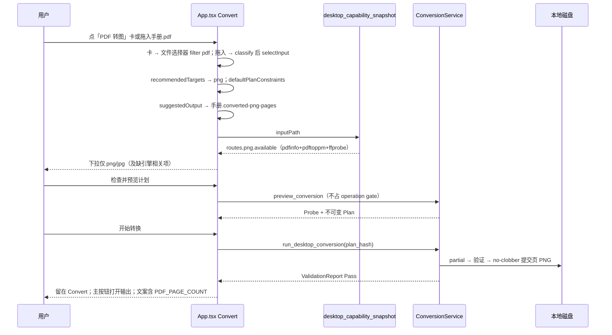
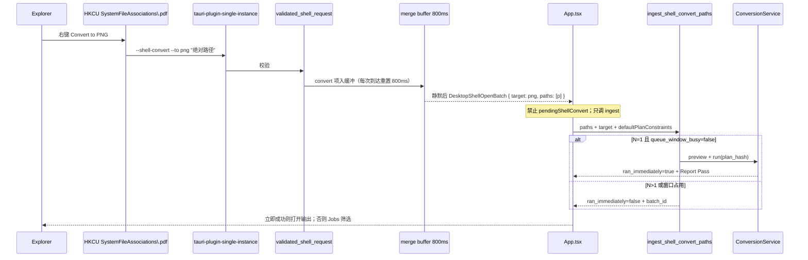
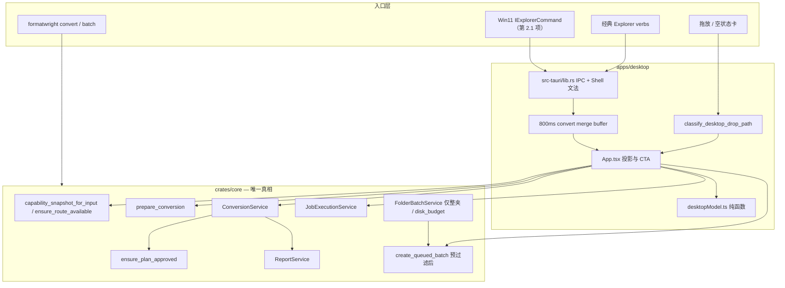
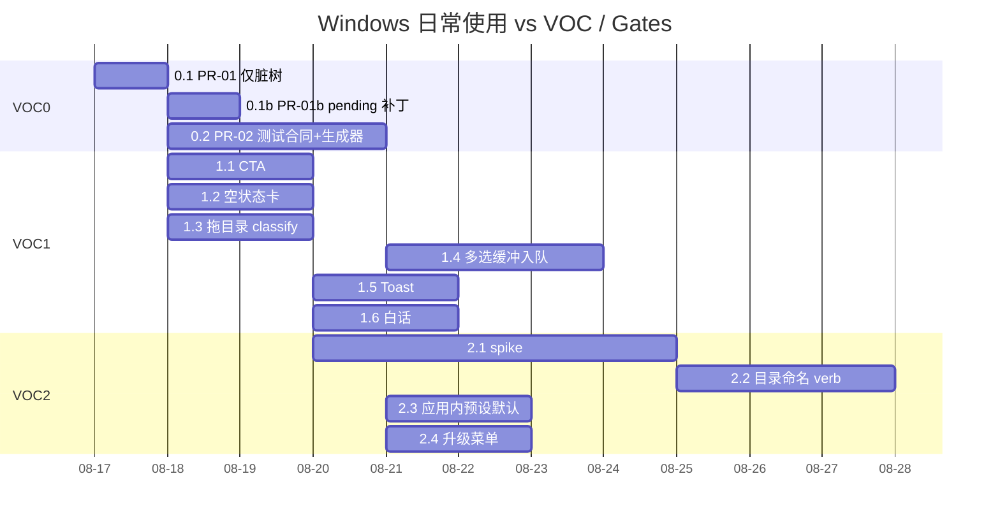

# FormatWright Windows 日常使用 Spec Plan

**文档类型：** 产品规格 + 技术规格 + 交付计划（下一增量，非 v0.1 Public Beta 总规格）  
**作者：** FormatWright maintainers（草稿）  
**日期：** 2026-08-17  
**状态：** Ready for implementation（评审 4 轮后 0 open）  
**权威边界：** 产品范围与发布门槛仍以仓库根目录 [`SPEC_PLAN.md`](../../SPEC_PLAN.md) 为准；本文件只定义 **Windows 日常使用手感** 这一增量。执行顺序以 [`VOC_BACKLOG.md`](../VOC_BACKLOG.md) 为准；Gate / R-xxx 关闭条件以 [`MASTER_EXECUTION_PLAN.md`](../MASTER_EXECUTION_PLAN.md) 为准。本增量把 Explorer **Convert to X** 写成与 CLI `convert` 同等的 **Plan-first 用户可见步骤例外**（见 KD-2）；Core 仍生成、哈希、验证 Plan。权威文档中「零自动任务 / 仅预填」的过时句由 **PR-02** 一次性改掉，避免 MASTER 勾选与产品合同打架。

---

## 一句话增量陈述

**在已有黄金路线与 Starter（PDF + Media）能力内，让 Windows 桌面同时具备 HowToConvert 式拖放三步转换，以及 FileConverter 式资源管理器「Convert to X」一键批准转换，而不追逐数千格式对。**

---

## Overview

FormatWright 的差异化不是格式数量，而是 Plan-first、Validate-always、local-first 与单一 Rust Core。截至 2026-08-17，Windows 开发候选已经能在本机完成 PDF→PNG/JPG、结构化互转、部分媒体路径，并具备经典 Explorer **Open in FormatWright**、按扩展名 **Convert to …**、capability snapshot 门控，以及 `--shell-convert --to FORMAT PATH` 冷/热启动。这些改动大量仍在脏工作树中；NSIS 钩子代码已写完整 Convert 键，但测试、MASTER、UX_FLOWS、WINDOWS_PACKAGING 仍编码「永不自动转换 / 只拥有两把 Open-in 键」。

本增量不重写 Core，也不开启 API/MCP。它把两条已拍板的入口做成「第一次就能转成功」的日常产品：拖一个 PDF 在 Convert 页三步出图（Plan 可见）；在资源管理器对 PDF 右键 **Convert to PNG** 即视为与 CLI `convert INPUT --to png` 同等的一次批准。窗口仍会生成不可变 Plan、绑定 `plan_hash`、验证后原子提交、永不静默覆盖。Open-in 继续只预填 Convert 页，是 GUI 上完整的 Plan-first 路径。

---

## Background & Motivation

### 当前状态（2026-08-17）

| 层 | 事实 | 证据路径 |
|---|---|---|
| 产品决策 | 拖放简单 + 右键一键转都做；不拼 HowToConvert 的数千路由；**Convert to X = 批准**；**Open in** 只预览 | `docs/release/PRODUCT_DECISIONS.md`「Owner decision — 2026-08-16」；`docs/VOC_BACKLOG.md` 已拍板栏 |
| Convert UI | `targetOptionViews` 在能力已知后隐藏不支持对，保留「缺引擎」路线；`qualityFieldApplies` 仅有损目标；`.xls` / 未知扩展名无推荐 | `apps/desktop/src/desktopModel.ts`；`apps/desktop/src/desktopModel.test.ts` |
| Shell | `parse_shell_invocation` / `validated_shell_request` 解析 `--shell-open` 与 `--shell-convert --to`；目录 convert 拒绝；FIFO 32 条；单实例转发 | `apps/desktop/src-tauri/src/lib.rs` |
| UI 自动跑 | `pendingShellConvert` 在 capability 可用后自动 `preview_conversion` + `run_desktop_conversion`；`applyShellOpen` **不**重置 quality/width/dpi/preset | `apps/desktop/src/App.tsx` |
| 安装钩子 | NSIS **代码**已写/删 per-extension Convert verb | `apps/desktop/src-tauri/windows-explorer-hooks.nsh`；`scripts/register_dev_explorer_convert.ps1`（手抄同一表，目前一致） |
| 测试合同（过时） | Explorer 烟测只跑 Open-in verb、断言 0 Job、卸载只查两把 Open-in 键；CLEAN_VM 脚本还查了不存在的 `*\shell\FormatWrightConvert` | `scripts/test_windows_explorer_integration.ps1`；`scripts/test_clean_vm_certification.ps1` L121–122 |
| Starter | 内嵌 PDF（Poppler）+ Media（FFmpeg）；无官方 HEIC / Office pack | `docs/testing/WINDOWS_STARTER.md` |
| 缺陷 | R-008 / R-009 为 **Fixed not Closed**（缺干净离线 VM） | `docs/DEFECT_REGISTER.md` |
| 发布包 | `WINDOWS_PACKAGING.md` 最近入档的标准 NSIS 是 **2026-08-16**（NotSigned）。VOC 备注 2026-08-17 本机重建过 `target/release/formatwright-desktop.exe` 并 HKCU testdrive，**不是**该文档里的已记录安装器哈希 | `docs/release/WINDOWS_PACKAGING.md`；VOC 备注 |

### 痛点

1. **第一次不会用。** Convert 空状态只有抽象拖放区，没有「PDF 转图 / JSON 转 YAML / 视频转 MP4」三张可点卡片（VOC 1.2）。
2. **结果找不到。** 单文件成功后强制切到 Reports 页（`App.tsx` 手动 `runConversion` 与 shell 自动跑 **两处** `setTab("reports")`）；主 CTA 不是「打开输出位置」。
3. **批量入口弱。** `onDragDropEvent` 对目录也走 `selectInput`；前端没有 `stat` / `plugin-fs`，无法可靠判断目录（VOC 1.3）。Explorer 多选时 `"%1"` 每文件一进程，间隔 **通常 200–800ms**。现有 `consumeShellOpens` 单次排水会先按 N=1 立即跑再被后续路径覆盖。修订 1 曾把合并静默期写成 350ms，**短于文档自己写的最大间隔**，400–800ms 的空隙仍会拆成多次 N=1（VOC 1.4）。
4. **诚实损失不够白话。** Plan 仍偏引擎术语；`.xls`、缺 LibreOffice、不支持三套文案未统一。`inputNotSupported` 已有骨架，但 `App.tsx` 在 `missing_engines` 为空时仍拼接英文 `route.message`。
5. **Win11 手感像「菜单没了」。** 经典 verb 落在「显示更多选项」（VOC 2.1）。
6. **权威文档与测试落后于代码。** `WINDOWS_EXPLORER_INTEGRATION.md`、`WINDOWS_PACKAGING.md`、MASTER 已勾选项、`UX_FLOWS.md` §1、`DESKTOP_MVP.md` 仍写导航-only / 零自动任务 / 两把键。USER_GUIDE / VOC / implementation-notes 已写 Convert=批准。Gate U 用错误键名，看不见 Convert 泄漏。
7. **脏工作树。** VOC 0.1：认证贯通、负向矩阵、转换页简化、shell-convert 尚未入库。
8. **热窗口泄漏约束。** 已打开的 Convert 页若残留 width=320 / quality=10 / 预设，Explorer Convert to PNG 会写进 Plan，不是 CLI `convert --to png`。

### 为什么现在做

负责人已书面批准双入口。Core 侧 `ConversionService` / `JobExecutionService` / `ReportService` / `capability_snapshot_for_input` / `ensure_route_available` / `ensure_plan_approved` 已共用（ADR-0001、ADR-0009）。增量应停在 **surface + 安装集成 + 日常 UX**，而不是再堆格式或开 Phase 6。

---

## Goals & Non-Goals

### Goals（本增量必须交付或排进 VOC 0–2 波可验收项）

- HowToConvert 手感：拖文件 → 只看见相关目标 → 预览 Plan → 转换；质量字段只对有损目标出现。
- FileConverter 手感：对白名单扩展名右键 **Convert to X**，两下（或现代菜单一下）出结果；Open-in 绝不开转。
- 成功后主按钮「打开输出位置」；多页 PDF 写清张数与目录。
- 文件夹作为一等入口：经 `classify_desktop_drop_path` 识别目录后自动切批量；映射预览 + 磁盘预算 + 原子入队。
- Explorer 多选（1.4）：后端 **800ms** 静默合并（每次到达重置）为文件列表批次；**所有** convert 批次走 `ingest_shell_convert_paths`。仅当 N=1 **且** 无队列窗口时立即转换；否则只入队。
- 诚实失败：`.xls`、未知扩展名、缺引擎三套用户可读中文，不伪装可转。
- Shell 合同：参数文法、允许目标、批准语义、不覆盖、单实例 + 静默合并。
- 安装/卸载拥有全部自有 verb 键；NSIS 与开发脚本由 **同一张表生成**。
- 与 VOC 第 0–4 波、MASTER Gate U / 2 / 4 对齐；**不开始 API / MCP**。

### Non-Goals

- 对标 HowToConvert 的数千格式对，或用引擎可读格式数当产品支持数。
- 官方 HEIC / Office / Document pack 的认证宣传（第 3 波）。Convert 页可继续对 `.heic` 推荐 jpg/png（缺引擎诚实），但 **不注册 verb、不进空状态卡、不写发布说明「支持 HEIC」**。
- Windows 11 现代顶层菜单必须本周做完。第 2.1 项先做 spike + 设计补记，第 1 波退出 **不依赖** 2.1。
- 运行时改写 Explorer verb 集合（第 2.3 项只改应用内默认，不改 HKCU 键表）。
- 对 Explorer 多选调用 `FolderBatchService::preview_mapping`（那是整树枚举 + 根互斥）。
- macOS Finder / Linux 文件管理器（VOC 第 5 波禁止）。
- REST API、MCP、Docker、自托管、浏览器 WASM。
- 静默覆盖、任意 FFmpeg 参数、Shell 模板插件、遥测、云账号。
- 把 R-008/R-009 在无干净 VM 的情况下标 Closed。
- 自动 commit、自动覆盖本机已安装环境。
- 常驻托盘 / 关主窗后保活进程。

---

## Key Decisions

每一条都是本增量的硬约束。实现与 PR 不得静默改写。

### KD-1 — 双入口都做，格式数量不做

**决策：** HowToConvert 式拖放与 FileConverter 式 Explorer 一键转同时在范围内。不追求格式对数量。  
**理由：** `PRODUCT_DECISIONS.md` 2026-08-16 负责人拍板；SPEC_PLAN §0.1 / §2.5 明确 No-Go「开源 HowToConvert 克隆」。  
**后果：** Explorer verb 只覆盖已声明黄金路线家族；新增 verb = 新增已支持路线，不是营销数字。

### KD-2 — Convert to X ≡ CLI `convert` 一次批准（Plan-first 的入口例外）

**决策：** 用户选择命名目标的右键 verb，即批准「用 **CLI 无额外旗标时的默认约束** 把该文件转到该目标」。Desktop 必须仍走 `prepare_conversion` → `ensure_plan_approved` → `ConversionService::run_prepared`（或队列等价路径）。禁止跳过验证或 no-clobber。

**与 SPEC_PLAN Plan-first 的关系（本增量对总规格的明示例外）：**

SPEC_PLAN §2.4「Plan-first：执行前先生成可解释计划」、§1.4「转换前知道会发生什么」、§7.1 普通模式三步，适用于 **Convert 页**。R-002 / MASTER 要求分离式预览提交 `plan_hash`；同时又写明 CLI 单命令 `convert` 把参数提交与执行视为同一次批准。Explorer **Convert to X** 对齐的是 **CLI**，不是 Convert 页的「预览后再点开始」。

- Plan **仍然**生成、哈希、验证、落报告；`prepare_approved_desktop_conversion` 不得省略 `ensure_plan_approved`。
- 用户在 Explorer 上不再获得「先读 Plan 再点开始」的回合。窗口必须出现，成功条与报告可打开，但不阻塞执行。
- **Open in FormatWright** 仍是 GUI 上完整的 Plan-first 路径：只预填，0 Job。
- 本例外必须写进 PR-02 对 MASTER / `UX_FLOWS.md` / `DESKTOP_MVP.md` 的同步，以免已勾选的「零自动任务」继续当产品真相。

**理由：** 负责人已批 Convert=批准；与 CLI 合同一致，避免表面绕过 Plan hash。  
**后果：** UI 可以为 N=1 shell convert 自动 preview+run，但必须携带刚生成的 `plan_hash`，并应用 `defaultPlanConstraints(target)`（KD-15），不得继承热窗口表单。

### KD-3 — Open in FormatWright 只预览

**决策：** `--shell-open PATH` 只预填 Convert 页（文件或目录）。不得设置 `pendingShellConvert`，不得创建 Job。  
**理由：** 打开 ≠ 批准。USER_GUIDE 与 VOC 已拍板。  
**后果：** 目录 Open-in 切到文件夹模式但不预览映射，直到用户选目标并点「检查文件夹」。

### KD-4 — 第 1 波目录 Convert 拒绝；第 2.2 项只开命名 verb

**决策：** 第 1 波 `validated_shell_request` 在 `convert_to.is_some() && !canonical.is_file()` 时返回 `None`。第 2.2 项 **只** 为 Directory 注册 `FormatWright.ToJpg` / `ToPng` / `ToWebp` 三个命名 verb，并把「convert + 目录」例外放宽 **仅** 对这些 verb。不是「按推荐目标」——目录没有扩展名，`recommendedTargets` / `supported_targets` 为空。  
**理由：** 整夹转换需要命名目标、兄弟输出根、磁盘预算；不能假装智能推荐。  
**后果：** 输出根为输入目录的 **同级** `{foldername}.converted-{target}`（例如 `C:\相册` → `C:\相册.converted-jpg`）。`preview_mapping` 禁止输出落在输入树内，兄弟目录满足该不变量。

### KD-5 — 下拉只展示相关路线

**决策：** 单文件、能力已知后，`targetOptionViews(..., "convert-file")` 只保留 `available === true` 或 `missing_engines.length > 0` 的目标。纯不支持对隐藏。缺引擎项 disabled，label 为 `{format} — 缺失`。  
**理由：** HowToConvert 简化；避免 PDF 出现 mp4 这种假选项。  
**后果：** 文件夹/预设 scope 仍展示完整候选。

### KD-6 — 推荐矩阵诚实

**决策：** `recommendedTargets`：`.xls`/`.xlsm`/`.xlsb` → `[]`；未知扩展名 → `[]`；不把 xls 推荐成 pdf/mp4。Office 新格式仅 `xlsx/docx/pptx → pdf`。`.heic`/`.heif` **保持** `["jpg","png"]`（与现码一致），供 Convert 页缺引擎诚实展示。  
**理由：** 旧 BIFF `.xls` 不在 GW-08。HEIC 推荐不是宣传 Certified，只是告诉用户「这类文件我们认得，但要 Image pack」。  
**后果：** `.xls` 走 `inputNotSupported`。HEIC 不注册 verb、不进空状态卡、不进发布说明（KD-10）。

### KD-7 — Quality 字段仅有损目标

**决策：** `qualityFieldApplies` = `jpg|jpeg|webp|avif|mp3|m4a|gif`。PNG、YAML、PDF、WAV 等 Convert 页不出现质量框。  
**预设：** 保存时若 `!qualityFieldApplies(target)`，丢弃 quality 字段（当 null）；`presetFieldChangeInvalidatesPreview("quality")` 在该目标上必须为 **false**（今日对 PNG 仍为 true，属实现债）。  
**理由：** 无损目标上的「质量 78」会暗示会压糊。  
**后果：** 预设编辑器 Conditionally 隐藏质量框，与 Convert 页同一函数。

### KD-8 — 建议路径永不覆盖

**决策：** 本增量 Explorer / 单文件建议名 **只有** `suggestedConvertedName`（见 KD-16 §9），不是 `folder_batch::unique_output_path`（后者是私有函数，产出 `photo.webp` / `photo.from-jpg.webp`，**没有** `.converted` 段）。单文件或批次内第一个占用 `stem.converted.{ext}`（PDF 栅格为目录 `stem.converted-{ext}-pages`）。同 stem 碰撞依次为 `stem.from-{srcExt}.converted.{ext}`、`stem.from-{srcExt}-{n}.converted.{ext}`。提交走 Core no-clobber；`OUTPUT_CONFLICT` 不得改成覆盖。  
**理由：** SPEC_PLAN FW-FR-034 / FW-NFR-008。  
**后果：** 同一源文件重复 Convert to PNG 第二次必须失败或改路径。

### KD-9 — 单一 Rust Core，入口不复制规则

**决策：** 格式是否可跑、缺哪个引擎、Plan、验证、提交，全部以 `formatwright-core` 为准。Desktop 只做 IPC / 投影 / 本地化。  
**理由：** ADR-0001、ADR-0009。  
**后果：** `recommendedTargets` 只做 UX 排序。`--to pdf file.xls` **进入 FIFO**（`pdf` 在允许目标里）；拒绝发生在 `ensure_route_available` → `Unsupported`。禁止在 `validated_shell_request` 复制扩展名×目标矩阵。

### KD-10 — Starter 内嵌；未认证能力不进 verb / 空状态 / 发布说明

**决策：** 出厂只有 Core + PDF + Media。Document 与 Image/HEIC 保持可选。  
**「不得进默认推荐宣传」收窄为三件实事：** 不注册 Explorer verb；不进空状态三卡；不写发布说明/USER_GUIDE 支持声明。Convert 页 `recommendedTargets` 仍可列出 HEIC→jpg/png，并靠 snapshot 显示缺 `heif-convert`。  
**理由：** PRODUCT_DECISIONS #6；避免改现有推荐测试的同时假装 Certified。  
**后果：** 本波不注册 `.xls` / `.heic` / `.xlsx` / `.docx` / `.pptx` / 目录 Convert。

### KD-11 — 经典菜单先交付；现代菜单 out-of-process；argv 基数分波

**决策：** 第 0–1 波只保证经典 verb（Win11 经「显示更多选项」）。第 2.1 项用 **out-of-process** IExplorerCommand，零引擎。  
**argv：** 第 1 波文法保持 **单路径** `--shell-convert --to T PATH`，多选靠后端 **800ms** 合并（KD-16）。第 2 波 **扩展** 为 `--shell-convert --to T -- PATH...`（`--` 之后全部当路径，同一套 `validated_shell_request` 逐条校验）。IExplorerCommand 一次 `IShellItemArray` 走扩展文法，避免再拆成 N 个进程。  
**理由：** 引擎进 `explorer.exe` 不可接受；过早冻结「永远单路径」会让 2.1 重蹈 1.4 的 FIFO 问题。  
**后果：** PR-09 是 spike + 设计补记，直到 Open Question 3（稀疏身份包）拍板。第 1 波退出不依赖 2.1。

### KD-12 — 不开始 API/MCP；发布阻断优先于新格式大类

**决策：** 与 VOC 规则一致。第 3 波格式包不得插入第 0–1 波之前。  
**理由：** MASTER §14；Gate 6 在 Public Beta 之后。  
**后果：** 本文件第 1 波 PR 不含 HEIC/Office/API。

### KD-13 — 脏树先收口；测试合同单独一切；行为补丁不混进基线

**决策：**  
- **PR-01** = 仅提交当前脏树 + 必要的「代码已如此」注释级对齐，**不**改行为。  
- **PR-01b** = `changeTarget` / 手动改输出 / 用户点预览 清除 `pendingShellConvert`；capability 自动改目标在 pending 期间必须保住 `wanted` 或诚实失败。  
- **PR-02** = **唯一**拥有 Explorer/VM 测试合同的 PR：完整拥有键、Open-in=0 Job、Convert=1 Job+Pass+源 hash、修正 CLEAN_VM `FormatWrightConvert` 笔误、同步 MASTER / UX_FLOWS / DESKTOP_MVP / WINDOWS_*。并由 PR-02 落地「一张表生成 nsh+ps1」。  

**理由：** VOC 0.1 要可回滚基线；把行为补丁和测试翻转塞进同一 commit 会让回滚变难。  
**后果：** 禁止「文档先改、测试后改」。未点头不自动 commit、不覆盖用户现有安装。

### KD-14 — 中英 UI 文案不进组件硬编码

**决策：** 新增空状态卡、成功 CTA、白话 Plan、三类失败文案全部进 `apps/desktop/src/i18n.ts`。普通模式不得展示 Core 英文 `route.message`。  
**理由：** SPEC_PLAN §7.6。  
**后果：** PR-08 必须替换 `App.tsx` ~1438 对 `route.message` 的插值，而不是只加 `plainLossSummary`。

### KD-15 — Shell-convert / 新输入使用 `defaultPlanConstraints(target)` 快照

**决策：** 每次 Explorer convert 批准（以及每次 `selectInput` 换新文件）应用：

```ts
function defaultPlanConstraints(target: string): PlanConstraintSnapshot {
  return {
    quality: null,          // 与 CLI 无 --quality 相同；由 Planner 填默认
    width: null,            // 不缩放
    dpi: null,              // PDF 渲染用 Planner 默认，不是表单残留 144
    colorMode: null,
    preserveAllStreams: true,
  };
}
```

忽略热窗口残留的 width/quality/dpi/colorMode/预设。`expert` 显示模式可保留，但不得把专家字段带进未展示的 Plan。  
**pending 期间的 capability 自动改目标：** 若 `routes[wanted].available`，**禁止**改成 `firstRecommended`；若不可用，清空 pending，停在缺引擎/不支持卡片。  
**理由：** CLI `convert INPUT --to T` 不用 GUI 残留状态；用户批准的是「转成 PNG」，不是「转成 320px PNG」。  
**后果：** 测试：热窗口 width=100 + Convert to PNG → 输出全尺寸 PNG。

### KD-16 — 多选：后端 800ms 缓冲 + 全量 ingest；立即转仅 N=1 且无队列窗

**决策：**

1. **收集：** 后端对 `convert_to` 请求 **不**交给前端逐条 `applyShellOpen`，也 **不**设置 `pendingShellConvert`。放入 **当前目标** 的 merge buffer；**同目标**到达重置 800ms 定时器。静默结束或因换目标立刻 flush 时：把 `DesktopShellOpenBatch` **写入后端 ready FIFO**（与 Open-in 一样，不靠事件 payload），再 emit `formatwright://shell-convert-batch` 作唤醒。前端必须 **先 listen 再** `take_desktop_shell_convert_batch`（冷启动 Starter/WebView ≫ 800ms 时事件会丢，FIFO 是真相）。`get_desktop_shell_open` 对 convert 不再 pop 单路径。Open-in 仍可单条立即投递，不打断 convert buffer。
2. **为何是 800ms 而不是 350ms：** 本文与 Explorer 行为都写明经典 `"%1"` 间隔 **通常 200–800ms**。静默期必须 **≥ 声称的最大间隔**：350ms 会把 400–800ms 的合法空隙拆成多次 N=1。800ms 覆盖该区间；测试不钉在刀刃上（见 T-SH-08）。静默等待期间 UI 可显示「正在合并所选文件…」。
3. **N 在静默之后计算，不在单次 FIFO drain 之后。** 同一 burst 内（间隔 100–400ms）必须合成一条 batch。定时器已触发后再来、距上一条 **≥900ms** 的到达是 **新会话**（独立算 N）。
4. **唯一执行入口：** 前端对 **每一条** `DesktopShellOpenBatch`（N=1 与 N>1）只调用 `ingest_shell_convert_paths`。**禁止**再用 `pendingShellConvert` + 现有 preview+run effect 跑 Explorer convert。
5. **后端判定（唯一）：**
   - 查询现有 queue-window lease（或廉价命令 `desktop_queue_window_busy`，与 `acquire_queue_window` **同一把锁**）。
   - `paths.len()==1` **且** `queue_window_busy==false` → `ConversionService` 立即 preview+run（KD-15 约束、`plan_hash`），`ran_immediately=true`，返回 `job` + `report`。
   - 否则（N>1，**或** 窗口已在跑）→ 预过滤。**幸存者为空则不得**调用 `create_queued_batch`（store 要求 1..=100_000）；返回 typed 空报告 `{ ran_immediately: false, batch_id: null, queued: 0, skipped_* }` + toast。否则 `create_queued_batch`，`ran_immediately=false`，**禁止**调用 `run_desktop_queue_window`。Toast + 切 Jobs 并按 `batch_id` 筛选。提示「已加入队列，当前窗口结束后可运行」当 `busy==true`。
6. **为什么不能走前端 effect：** `run_desktop_queue_window` 持有的 `acquire_active_operation` 是计数器，**不会**拒绝并行的 `run_desktop_conversion`。若 N=1 仍走 `pendingShellConvert` effect，T-SH-15 会假绿或假红，且 effect 无法返回 `ran_immediately`。
7. **原语：** **文件列表 ingest**，不是文件夹树。禁止调用 `FolderBatchService::preview_mapping`。
8. **冲突：** 在调用 `create_queued_batch` **之前** 过滤已存在输出并计数。全员被跳过/拒绝时见 §5，**零** SQLite batch 行。
9. **同 stem（唯一函数 `suggestedConvertedName`，本增量自有，不调用私有 `unique_output_path`）：**
   - 单文件 / 批次内第一次占用：`{stem}.converted.{target}`（PDF→图：目录 `{stem}.converted-{target}-pages`）。
   - 批次内（或已存在）碰撞：`{stem}.from-{srcExt}.converted.{target}`，再碰撞 `{stem}.from-{srcExt}-{n}.converted.{target}`（n 从 2）。
   - **禁止** `photo.webp` / `photo.from-jpg.webp` 这种无 `.converted` 的 folder-batch 名。
   - 钉死例子（输入序 jpg 然后 png → webp）：`photo.converted.webp` 与 `photo.from-png.converted.webp`。
10. **磁盘：** 按 **每个不同父卷** 调用 `FolderBatchService::disk_budget`。
11. **混目标：flush 旧 batch，不要整段丢弃。** 经典多选同一 verb 不会产生两个 `--to`。800ms 内两个不同 verb（PDF Convert to PNG，再 JPG Convert to WebP）是两次 KD-2 批准。算法：若新到达的 `--to` **不等于** 当前 buffer 目标 → **立刻**把旧 buffer flush 进 ready FIFO（不等 800ms），再为新目标开 buffer（新定时器）。同目标仍只重置 800ms。禁止「targets not unique → reject mix」（会两头都不转）。文案「请只选择同一 Convert 目标」只留给第 2 波 `-- PATH...` 若错误地带了多个目标（合同禁止那样的 argv）。
12. **IPC 名冻结：** `take_desktop_shell_convert_batch`（pop ready FIFO）→ `ingest_shell_convert_paths`。事件只唤醒。`desktop_queue_window_busy -> bool` 仅供 UI。ready FIFO 建议最多 8 条 batch，满则丢最旧并提示。

**理由：** 经典 Explorer 间隔可达 800ms；前端 effect 无法感知 queue-window lease。VOC 1.4 第 1 波收窄为「入队；用户点运行」。  
**后果：** T-SH-08 一条 batch；T-SH-15 N=1+窗口占用 → queue-only；T-SH-13 精确文件名如上；T-SH-16 换目标 flush 两批；T-SH-14 全冲突不建 batch。

### KD-17 — 第 1 波通知是 Toast，非常驻托盘、不保活

**决策：** VOC 1.5 用系统通知（`tauri-plugin-notification` 或等价 Win32 toast）+ `capabilities/main.json` 授权。主窗关闭 = 进程退出。不改 `ApplicationSettings` schema（v1 `deny_unknown_fields`，只有 `schema_version` / `language` / `expert_mode`）。  
**理由：** 常驻托盘改变「退出即停止」；改 settings schema 会拒读旧文件或逼 major。  
**后果：** PR-07 范围含插件、capability grant、点击回前台；不含 tray icon / keep-alive。

---

## User Journeys

以下五条是本增量的验收剧本。

### Journey A — 首次拖 PDF → PNG（HowToConvert）

**角色：** 未装开发工具的 Windows 用户，刚装完 current-user NSIS（内嵌 Starter）。  
**前置：** 首次启动已激活 `formatwright-pdf` + `formatwright-media`；无系统 Poppler/FFmpeg。



| 步骤 | 期望 |
|---|---|
| 空状态 | 三张卡。「PDF 转图」可点 → **打开文件选择器**（filter `pdf`），**不**自动造假文件、不塞示例路径。 |
| 灰态 | 以 `routes.png.available` 为准（需要 pdfinfo+pdftoppm+**ffprobe**），不是只查 Poppler。 |
| 拖入 | `convertMode=file`；目标默认 `png`；输出 `*.converted-png-pages`。 |
| 字段 | 无 quality（PNG）；专家模式才有 DPI/色模式。 |
| 预览 | 真实格式 PDF、有损渲染、页数、保留/改变/丢弃。 |
| 执行 | 主程序不读入整个 PDF。 |
| 成功 | **两处** `setTab("reports")` 都去掉（手动跑 + shell 自动跑）。主 CTA = 打开目录。页数 = `report.checks` 中 `code==="PDF_PAGE_COUNT"` 的 `observed`；缺失则枚举 `job.output_path` 已提交文件；**禁止**写死 15。 |
| 再转一次 | 目录已存在 → `OUTPUT_CONFLICT`；源 PDF 字节不变。 |

**当前缺口：** 无三张卡；两处切 Reports；无 `classify_desktop_drop_path`。  
**VOC：** 1.1、1.2。**Gate：** U。

### Journey B — Explorer Convert to PNG（FileConverter）

**角色：** 同一用户，资源管理器中对着一份 **小 PDF 夹具**（烟测不用 15 页 ST508S，除非单独预算分钟级超时）。



| 步骤 | 期望 |
|---|---|
| Win10 / Win11 经典 | PDF 有 **Convert to PNG** / **Convert to JPG**。 |
| 第 1 波 Win11 | 允许藏在「显示更多选项」。2.1 不挡第 1 波退出。 |
| 批准 | 点 verb = CLI `convert --to png`。约束来自 KD-15，不是热窗口 width/quality。 |
| Open-in 对照 | 0 Job。 |
| 目录 | 第 1 波丢弃 convert+目录。 |
| 冲突 | 失败可见，不覆盖。 |
| 缺 PDF pack | `routes.png.available=false` → 清空 pending，中文缺引擎，**不**改成别的可用目标。 |
| 热窗口 | 已开的 Convert 页 width=100、quality=10：输出仍为全尺寸、Planner 默认质量。 |

**当前缺口：** 约束快照；测试合同仍当 0 Job；成功 CTA。  
**VOC：** 雏形 + 1.1。

### Journey C — 文件夹批量（拖放，非 Explorer 多选）

**角色：** 用户拖入相册目录，或 Convert 页切到「文件夹批量」。

| 步骤 | 期望 |
|---|---|
| 拖目录 | `onDragDropEvent` 把首个 path 交给 **`classify_desktop_drop_path`**（与 `validated_shell_request` 同一套本地盘 / 文件 / 目录 / 拒 UNC）。`directory=true` → `setConvertMode("folder")` + `folderInputRoot`，**不**走 `selectInput`。前端不做尾部斜杠猜测。 |
| 预览 | 现有 `preview_desktop_folder_batch`：递归、不跟随链接、根互斥、最多 10,000 Plan、样本 100、TTL 15 分钟、缓存 32。 |
| 磁盘 | `disk_budget.sufficient` 为假时主按钮禁用。 |
| 入队 | `queue_desktop_folder_batch` 后 Jobs 按 `batch_id` 筛选；**用户点**「运行队列窗口」。 |
| Explorer 目录（第 2.2 项，非本波） | 仅 `ToJpg` / `ToPng` / `ToWebp`。输出兄弟目录 `{foldername}.converted-{target}`。走 `preview_mapping` + 磁盘预检 + 入队。第 1 波与 1.4 文件列表无关。 |

**当前缺口：** 无 classify IPC；拖目录不切模式。  
**VOC：** 1.3；2.2 属第 2 波。

### Journey D — 不支持的 `.xls`

| 步骤 | 期望 |
|---|---|
| 推荐 | `recommendedTargets` → `[]`。 |
| 下拉 | 能力返回后无相关项 → `inputNotSupported`。 |
| 文案 | 第 1.6 项短句：「这是旧版 Excel。请另存为 .xlsx 后再转 PDF。」 |
| Explorer | **不注册** `.xls` Convert verb。 |
| 伪造 argv | `--shell-convert --to pdf file.xls`：**进入 FIFO**（`pdf` ∈ 允许目标）。UI/Core `ensure_route_available` → `Unsupported`。0 输出。不是「解析期丢弃」（那是 `--to exe`）。 |

**VOC：** 1.6。

### Journey E — 有 xlsx、缺 LibreOffice

| 步骤 | 期望 |
|---|---|
| 推荐 | `xlsx → ["pdf"]`。 |
| Snapshot | `soffice, pdfinfo, pdftoppm`；`missing_engines` 含 `soffice`。 |
| 下拉 | `pdf — 缺失`。 |
| 横幅 | 中文「缺少 Document 包（soffice）」，**不**展示英文 `route.message`。 |
| 按钮 | 禁用。 |
| Shell | 本波不注册 `.xlsx` verb。手动 `--to pdf 预算.xlsx`：进 FIFO，缺引擎诚实失败，pending 清除，**不**改目标。 |

**VOC：** 1.6、3.3。

---

## Proposed Design

### 总体结构（不改分层）



依赖方向不变。`FolderBatchService::preview_mapping` **只**服务 Convert 页整夹与第 2.2 项目录 verb，不服务 Explorer 多选。

### 日常使用控制流

```mermaid
flowchart TD
  Start["输入到达"] --> Kind{来源}
  Kind -->|拖放| Class["classify_desktop_drop_path"]
  Class -->|file| FileUI["selectInput + defaultPlanConstraints"]
  Class -->|dir| FolderUI["convertMode=folder"]
  Class -->|reject| Ignore["不改选择"]
  Kind -->|--shell-open| OpenOnly["预填；pending=null"]
  Kind -->|--shell-convert| Buf["merge buffer 800ms 重置"]
  Buf --> Batch["DesktopShellOpenBatch"]
  Batch --> Ingest["一律 ingest_shell_convert_paths"]
  Ingest -->|N=1 且 !busy| ShellOne["后端立即 ConversionService"]
  Ingest -->|N>1 或 busy| ShellMany["预过滤 + create_queued_batch"]
  Kind -->|第1波 convert+目录| Reject["丢弃"]

  FileUI --> Snap["capability snapshot"]
  OpenOnly --> Snap
  Snap --> Gate{routes[wanted].available}
  Gate -->|否| Honest["停在 Convert；不改 target"]
  Gate -->|是，手动| Preview["用户点预览"]
  Preview --> Run["run / queue + plan_hash"]
  FolderUI --> Map["preview_mapping + disk"]
  ShellOne --> Commit["验证 + no-clobber"]
  ShellMany --> JobsTab["Toast + Jobs 筛选；不跑窗口"]
  Map --> EnqUser["用户确认后入队"]
  EnqUser --> JobsTab
  Run --> Commit
  JobsTab -->|用户点运行| Window["run_desktop_queue_window"]
  Window --> Commit
  Commit --> CTA["打开输出位置"]
```

### Convert 页信息架构（增量后）

1. **空状态（无 inputPath 且非 folder 根）：** 拖放区 + 三张能力卡。点卡 = 文件选择器。
2. **单文件工作区：** 表单 + 白话 Plan + **成功条**（主 CTA 打开输出）。成功不切 Reports。
3. **文件夹工作区：** 现有 mapping preview。

### Shell 多选（VOC 1.4）— 文件列表 ingest

经典 `"%1"` = **每文件一个进程**，间隔通常 **200–800ms**。350ms 静默短于该上界，会把一次多选拆成多次 N=1。前端 `consumeShellOpens` 一次 drain 不是合并窗口。

**后端 merge buffer（唯一收集模型）：**

```
handle_second_instance / setup argv
  → validated_shell_request
  → if convert_to.is_none():
        enqueue Open-in immediately   // 不 flush convert buffer
  → else if buffer empty OR target == buffer.target:
        buffer.push(path)
        reset 800ms timer             // 同目标才重置
        optional UI: "merging…"
  → else:  // 不同 --to：两次独立批准，禁止 reject mix
        ready_fifo.push(DesktopShellOpenBatch { target: buffer.target, paths })
        emit wake-up only
        buffer = { target: new, paths: [path] }
        start 800ms timer
  → on quiet (800ms, no same-target arrival):
        ready_fifo.push(DesktopShellOpenBatch { target, paths })
        emit formatwright://shell-convert-batch   // 唤醒，不是真相
```

**Ready FIFO 是真相：** 冷启动 WebView 订阅前静默就可能结束。合同与 Open-in 相同：stash → emit → 前端 listen **然后** `take_desktop_shell_convert_batch`。禁止只把 batch 放在事件 payload 里。FIFO 最多 8 条 batch；满丢最旧。

前端 **禁止**对 convert 批次逐条 `applyShellOpen`，**禁止**设置 `pendingShellConvert`。只把 batch 交给 `ingest_shell_convert_paths`，再按返回值画 CTA / Jobs / toast。表单可套 KD-15 快照以便与已跑 Plan 一致。

**`ingest_shell_convert_paths`（N=1 与 N>1 的唯一执行入口）：**

```
busy = desktop_queue_window_busy()  // 与 acquire_queue_window 同一 lease
constraints = defaultPlanConstraints(target)

if paths.len() == 1 && !busy:
  prepare_conversion + ConversionService::run_prepared(plan_hash)
  return { ran_immediately: true, job, report, batch_id: null,
           skipped_conflict: 0, skipped_disk: 0, rejected: 0 }

// N>1 or window already running — never run_desktop_queue_window
reserved = {}
for path in paths (stable input order):
  validate like validated_shell_request (file, local disk)
  prepare_conversion(path, target, constraints)
  if Unsupported / EngineMissing: rejected++; continue
  output = suggestedConvertedName(path, target, reserved)  // KD-16 §9
  reserved.add(output)
  if output exists on disk: skipped_conflict++; continue
  keep JobCreateRequest
group remaining by output volume
for each volume:
  FolderBatchService::disk_budget(volumeRoot, reqs, parallelism)
  if !sufficient: skipped_disk += those reqs
if surviving.is_empty():
  return { ran_immediately: false, batch_id: null, queued: 0,
           skipped_conflict, skipped_disk, rejected }  // 不建 SQLite batch
create_queued_batch(surviving)  // never preview_mapping
return { ran_immediately: false, batch_id, queued: surviving.len(),
         skipped_conflict, skipped_disk, rejected }
```

`preview_mapping` 与 `unique_output_path` 明确 **out of scope for 1.4**。

**`suggestedConvertedName`（唯一命名函数，可放 `desktopModel.ts` + Rust 镜像，禁止调用私有 `unique_output_path`）：**

| 情况 | 输出 |
|---|---|
| 普通单文件 / 批次内该 stem+target 第一次 | `{stem}.converted.{target}` |
| PDF→png/jpg | 目录 `{stem}.converted-{target}-pages` |
| 批次内或 reserved/磁盘碰撞（src=`jpg`） | `{stem}.from-jpg.converted.{target}` |
| 仍碰撞 | `{stem}.from-jpg-2.converted.{target}` … |

钉死：`photo.jpg` 然后 `photo.png` → webp → `photo.converted.webp` + `photo.from-png.converted.webp`。

FIFO 32 仍是 **进程到达** 上限；静默合并后的 `paths[]` 最多 32。溢出提示「只接收了最近 32 个；请改用文件夹批量」。

### 白话 Plan（VOC 1.6）

`plainLossSummary(plan)` 纯函数，输入 `plan.steps[].loss_class`（kebab-case：`none` | `container-only` | `lossless` | `lossy` | `unknown`）与 `plan.changes.dropped`。

求值顺序（先匹配先返回）：

| 优先级 | 条件 | 徽章 id | 中文 | 英文 |
|---|---|---|---|---|
| 1 | 任一步 `lossy` | `lossy` | 会压糊或降低质量 | Lossy — quality will change |
| 2 | `dropped` 含轨道/字幕/章节类键（`track`/`stream`/`subtitle`/`chapter` 子串，大小写不敏感） | `drop-tracks` | 会丢轨道或字幕 | Tracks will be dropped |
| 3 | 任一步 `unknown` | `unknown` | 还不能证明有没有损失 | Loss not yet proven |
| 4 | 全部步骤 ∈ {`none`, `container-only`} 且无 `lossy`/`unknown` | `container` | 只换容器，画面和声音不重压 | Container change only |
| 5 | 否则（含 `lossless` 渲染/转码） | `lossless` | 会重编码，但按计划是无损 | Lossless re-encode |

`none` 单独出现且无 drop → 归入第 4 档（与 container-only 一样「没有内容损失声明」）。专家模式仍列出逐步 `loss_class`。

错误映射（普通模式，**替换** `route.message` 插值）：

| 条件 | 用户句 |
|---|---|
| 扩展名 xls/xlsm/xlsb | 这是旧版 Excel。请另存为 .xlsx 后再转 PDF。 |
| `ErrorCode::Unsupported` | 这个格式对不在当前支持名单。FormatWright 不靠堆格式对。 |
| `ErrorCode::EngineMissing` | 缺引擎包：{names}。打开「引擎」导入官方包。xlsx 缺 soffice 时点名 Document pack。 |
| `ErrorCode::OutputConflict` | 目标已存在，没有覆盖。请改保存位置。 |
| `ErrorCode::PolicyBlocked` | 没有批准的 Plan，不能转。 |

### 成功 CTA（VOC 1.1）

复用 `reveal_desktop_job_output(jobId)`。

- 留在 Convert。PR-03 删除 **两处** `setTab("reports")`：`runConversion`（约 L736）与 shell 自动跑（约 L774）。
- PDF 页数：`checks.find(c => c.code === "PDF_PAGE_COUNT")?.observed`；否则计数输出目录已提交文件；禁止写死 15。
- Warning 可打开输出。Fail 无主打开按钮。

### 空状态三张卡（VOC 1.2）

| 卡 | 点击 | 灰态 |
|---|---|---|
| PDF 转图 | `open({ filters: pdf })`，选后 Journey A | `!routes.png?.available`（等一次无 input 的 Doctor/snapshot：用任意占位 `file.pdf` 调 `desktop_capability_snapshot` 或 Doctor 引擎列表；推荐启动时缓存 `CapabilitySnapshot` for `probe.pdf`） |
| JSON 转 YAML | 选择器 filter json；目标 yaml | **永不灰**（内置 structured；`required_engines` 为空） |
| 视频转 MP4 | 选择器 mkv/mov/avi/webm；目标 mp4 | `!routes.mp4?.available`（对视频占位扩展名） |

无 HEIC 卡。灰卡可点 → Engines，说明 `missing_engines`。

无 input 时没有 per-file snapshot：启动拉一次 Doctor / 对合成扩展名取三条路线（`dummy.pdf` / `dummy.mkv` 只用于扩展名，不访问磁盘——`capability_snapshot_for_input` 今日只看扩展名，可用不存在的绝对本地路径如 `C:\formatwright-probe.pdf`，但 **不要** canonicalize 失败挡住；空状态卡应走 **引擎是否 inspect 成功**，与 `required_engines` 对齐，而不是真实文件）。实现约定：新增 `desktop_capability_snapshot_for_extension(ext)` 或对 `capability_snapshot_for_input` 在路径不存在时仍按扩展名返回（今日已不要求文件存在——`ensure_route_available` 测试用 `Path::new("fixture.pdf")`）。空状态复用该行为即可。

### Win11 现代菜单（VOC 2.1）


- COM 只拼 argv，零 I/O / 引擎 / 网络。
- 第 1 波不实现。PR-09 = spike + 设计补记（身份包 / AUMID / 卸载），直到 Q3。
- 与经典 verb 共用生成表。

---

## Shell 合同

### 参数文法

**第 1 波（冻结实现）：**

```
formatwright-desktop.exe --shell-open <ABS_PATH>
formatwright-desktop.exe --shell-convert --to <FORMAT> <ABS_PATH>
```

**第 2 波扩展（文法预留，PR-09/10 落地）：**

```
formatwright-desktop.exe --shell-convert --to <FORMAT> -- <ABS_PATH> [<ABS_PATH> ...]
```

`--` 之后每个参数都是路径，逐条走同一校验。第 1 波解析器若见到 `--` 可忽略或拒绝（测试钉死：第 1 波未见 `--`）。

`parse_shell_invocation` 语义：

1. 丢弃 argv[0]。
2. `--shell-open` 后一项为路径。
3. `--shell-convert` 置位；`--to` 后一项经 `normalize_shell_convert_target`。
4. 已看见 open/convert 后，第一个非 `-` 参数可作为路径。
5. **同时出现 `--shell-open` 与 `--shell-convert`：** 若 `--to` 解析成功则 **convert 赢**（`(path, Some(target))`）；否则整请求 `None`。须补单测（今日未指定）。
6. 缺标记 → `None`。
7. `saw_convert` 且目标非法（`exe`）→ `None`。
8. 第 2 波：`--` 后收集多路径，校验全部失败则 `None`。

前端 `normalizeShellTarget` / `SHELL_CONVERT_TARGETS` ≡ Rust `ALLOWED_SHELL_CONVERT_TARGETS`。

### 允许目标 vs 已注册 verb

**解析允许集（parser ⊇ verbs）：**

```
jpg png webp avif mp4 mp3 m4a wav gif pdf docx json csv yaml xml
```

`avif` / `gif` / `m4a` / `pdf` / `docx` 本波 **允许出现在 argv**，**不**注册为 Explorer verb。拒绝发生在 Core 路线检查，不是解析器。

别名：`jpeg→jpg`，`yml→yaml`。

**已注册经典 verb（本波，生成表唯一源）：**

| 关联 | Verb 名 | `--to` | 标签 |
|---|---|---|---|
| `.pdf` | `FormatWright.ToPng` / `ToJpg` | png / jpg | Convert to PNG / JPG |
| `.png` `.jpg` `.jpeg` | `FormatWright.ToWebp` | webp | Convert to WebP |
| `.json` | `FormatWright.ToYaml` | yaml | Convert to YAML |
| `.csv` `.yaml` `.yml` `.xml` | `FormatWright.ToJson` | json | Convert to JSON |
| `.mp4` | `FormatWright.ToMp3` | mp3 | Convert to MP3 |
| `.mkv` `.mov` `.avi` `.webm` | `FormatWright.ToMp4` | mp4 | Convert to MP4 |
| `.mp3` | `FormatWright.ToWav` | wav | Convert to WAV |
| `.wav` | `FormatWright.ToMp3` | mp3 | Convert to MP3 |

**Explorer vs Convert 页默认可以不同：** `.mp4` 右键是抽音频（ToMp3）；Convert 页 `recommendedTargets` 首选 `mp4`（remux）。这是有意的：菜单给「最常见一键」，页面给「同家族首选」。不要为了对齐而改推荐矩阵。

**明确不注册：** `.xls`、`.heic`、`.xlsx`、`.docx`、`.pptx`、第 1 波 Directory Convert。`*` 与 `Directory` 只有 Open-in。

第 2.2 项 **另外** 在 `Directory\shell` 下增加且仅增加：

| 关联 | Verb | `--to` | 输出根 |
|---|---|---|---|
| `Directory` | `FormatWright.ToJpg` | jpg | `{parent}\{name}.converted-jpg` |
| `Directory` | `FormatWright.ToPng` | png | `{parent}\{name}.converted-png` |
| `Directory` | `FormatWright.ToWebp` | webp | `{parent}\{name}.converted-webp` |

### 校验（`validated_shell_request`）

| 检查 | 失败行为 |
|---|---|
| 路径非绝对 | 丢弃 |
| Windows 非 `Disk` / `VerbatimDisk` | 丢弃 |
| `canonicalize` 失败 | 丢弃 |
| 第 1 波 convert 且不是文件 | 丢弃 |
| 第 2.2 项目录 + convert 且 verb∈{ToJpg,ToPng,ToWebp} | 接受 `directory=true` |
| 既不是文件也不是目录 | 丢弃 |

```rust
struct DesktopShellOpen { path: PathBuf, directory: bool, convert_to: Option<String> }

struct DesktopShellOpenBatch { target: String, paths: Vec<PathBuf> }
```

Open-in IPC：`get_desktop_shell_open`（单条，仅 `convert_to=None`）。  
Convert 批次：**ready FIFO** + `take_desktop_shell_convert_batch`（pop 一条）。事件 `formatwright://shell-convert-batch` **只唤醒**，payload 可空。禁止 event-payload-only。禁止前端对 convert 再 pop 单路径。冷启动与 Open-in 一样 listen-then-drain。

`classify_desktop_drop_path(path) -> { kind: "file"|"directory"|"rejected", path? }`：复用同一本地盘规则，**不**要求 `--shell-*` 标记。

### 批准语义

| 标记 | 批准？ | Desktop 行为 |
|---|---|---|
| `--shell-open` | 否 | 预填；0 Job |
| `--shell-convert --to T` 静默后 N=1 且窗口空闲 | 是 ≡ CLI `convert --to T` | `ingest_shell_convert_paths` 内部立即跑；`ran_immediately=true` |
| 同上 N>1 | 是（每项同一目标） | 同一 ingest **只入队**；不跑窗口 |
| 队列窗口已占用（任何 N） | 是 | 同一 ingest 只入队；`ran_immediately=false` |
| CLI `convert` | 是 | `ConversionService` |
| CLI `convert --dry-run` | 否 | 只出 Plan |
| UI 预览 | 否 | Preview |
| UI 开始 / 加入队列 | 是（plan_hash） | R-002 |

### 不覆盖

建议路径不是安全边界。安全边界是 no-clobber publish。多选冲突 **预过滤**，不让 `create_queued_batch` 整批失败。

### 单实例转发

- 单实例插件先注册。
- Convert 走 merge buffer + **ready FIFO**（take 之前一直保留），不是「同事件循环排水」或 event-only。
- Open-in 立即 FIFO（仍 32，丢最旧）。
- 不得二次 `setup_desktop`。
- `preview_conversion` **不**占用 `DesktopOperationGate`；`run_desktop_conversion` 占用。文档不得写「gate 互斥预览」。
- `acquire_active_operation` **允许**并发立即转换（计数器 +1）；互斥的是 maintenance vs active，以及 **一个** `acquire_queue_window`。

### 安装器拥有的注册表键

第 1 波拥有集 = 2 Open-in + **17** Convert 键（与下表一致，共 19）。PR-02 测试必须用这一集合，并修复 CLEAN_VM 的 `FormatWrightConvert` 错误名。

```
Software\Classes\*\shell\FormatWright
Software\Classes\Directory\shell\FormatWright
Software\Classes\SystemFileAssociations\.pdf\shell\FormatWright.ToPng
Software\Classes\SystemFileAssociations\.pdf\shell\FormatWright.ToJpg
Software\Classes\SystemFileAssociations\.png\shell\FormatWright.ToWebp
Software\Classes\SystemFileAssociations\.jpg\shell\FormatWright.ToWebp
Software\Classes\SystemFileAssociations\.jpeg\shell\FormatWright.ToWebp
Software\Classes\SystemFileAssociations\.json\shell\FormatWright.ToYaml
Software\Classes\SystemFileAssociations\.csv\shell\FormatWright.ToJson
Software\Classes\SystemFileAssociations\.yaml\shell\FormatWright.ToJson
Software\Classes\SystemFileAssociations\.yml\shell\FormatWright.ToJson
Software\Classes\SystemFileAssociations\.xml\shell\FormatWright.ToJson
Software\Classes\SystemFileAssociations\.mp4\shell\FormatWright.ToMp3
Software\Classes\SystemFileAssociations\.mkv\shell\FormatWright.ToMp4
Software\Classes\SystemFileAssociations\.mov\shell\FormatWright.ToMp4
Software\Classes\SystemFileAssociations\.avi\shell\FormatWright.ToMp4
Software\Classes\SystemFileAssociations\.webm\shell\FormatWright.ToMp4
Software\Classes\SystemFileAssociations\.mp3\shell\FormatWright.ToWav
Software\Classes\SystemFileAssociations\.wav\shell\FormatWright.ToMp3
```

单一源：例如 `apps/desktop/src-tauri/explorer-verbs.json`（或 `crates/core` 常量 + build.rs）。**PR-02** 增加生成器，写出 `windows-explorer-hooks.nsh` 与 `register_dev_explorer_convert.ps1`，禁止再手抄。卸载只删生成表里的键 + 2 把 Open-in。第 2.3 项 **不**在运行时增删键。

---

## Convert UI 合同

### 下拉（`targetOptionViews`）

行为冻结（见现测试）。`<option value>` 永远是规范格式名。

### 出现哪些字段（普通模式）

| 字段 | 出现条件 |
|---|---|
| 输入 / 输出路径 | 单文件 |
| 输入 / 输出文件夹 | 文件夹模式 |
| 目标 | 始终；`capabilityBusy` 时单文件 disabled |
| 质量 | `qualityFieldApplies(target)` |
| 专家字段 | 仅专家模式 |
| 能力横幅 | 有 input 且加载中 / 当前路线不可用 / 家族不可跑 / 不支持；文案走 i18n，不插英文 `route.message` |
| 成功条 | `report.status` ∈ pass/warning 且有 job_id |
| 空状态三卡 | 无输入且非 folder |

### 自动 shell 跑与手动预览

- Convert 批次只经 `DesktopShellOpenBatch`，然后 **一律** `ingest_shell_convert_paths`。
- **禁止**对 Explorer convert 设置 `pendingShellConvert` 或走现有 preview+run effect（该 effect 看不见 queue-window lease，且 `acquire_active_operation` 不会挡住并行立即转换）。
- 前端收到 ingest 结果后：`ran_immediately=true` → 套 KD-15 快照到表单、展示成功条/报告；`false` → Jobs 筛选 + toast，不开始转换。
- `changeTarget` / 手动改输出 / 用户点预览 → `pending=null`（PR-01b，仅残留拖放/Open-in 路径）。
- capability effect 在手动 `pending != null` 时：保持 `wanted`；不可用则清 pending，**不** `setTarget(firstRecommended)`。
- `selectInput`（拖放/选文件）同样套用 `defaultPlanConstraints`。

---

## API / Interface Changes

无 REST。

### 保持不变

- `preview_conversion`（无 operation gate） / `run_desktop_conversion` / `queue_desktop_conversion`
- `preview_desktop_folder_batch` / `queue_desktop_folder_batch`（整夹 only）
- `desktop_capability_snapshot` / `desktop_doctor`
- `reveal_desktop_job_output`
- `ensure_plan_approved`

### 新增或收紧（名称冻结）

| 接口 | 变更 |
|---|---|
| `classify_desktop_drop_path` | PR-05。`{ path } → { kind, path? }` |
| `DesktopShellOpenBatch` | `{ target: string, paths: string[] }` |
| `take_desktop_shell_convert_batch` | PR-06。pop ready FIFO 一条 `DesktopShellOpenBatch`；无则 `null`。事件只唤醒 |
| `desktop_queue_window_busy` | PR-06。`()` → `bool`。与 `acquire_queue_window` **同一 lease**；仅供 UI。判定权威在 ingest 内部 |
| `ingest_shell_convert_paths` | `{ paths, target }` → `{ ran_immediately, batch_id?, queued, job?, report?, skipped_conflict, skipped_disk, rejected }`。**N=1 且 !busy 时立即跑**；否则只入队。`queued==0` 时 `batch_id=null`，不写 SQLite |
| `suggestedConvertedName` | TS + Rust 镜像同一规则（KD-16 §9） |
| `defaultPlanConstraints` / `plainLossSummary` / `emptyStateCardAvailability` | `desktopModel.ts` 纯函数 |
| `parse_shell_invocation` | 补双标记测试；第 2 波才收 `-- PATH...` |
| verb 生成器 | PR-02：json → nsh + ps1 |
| `tauri-plugin-notification` + `capabilities/main.json` | PR-07：`notification:default`（或最小 allow） |

---

## Data Model Changes

**无 SQLite schema 变更。** 无 `ApplicationSettings` 变更。

| 数据 | 变化 |
|---|---|
| Job / Plan / Report | 无新字段 |
| Batch | 多选入队 `create_queued_batch`，名 `Explorer: {n} files → {target}` |
| PresetLibrary | **第 2.3 项不改 schema、不写注册表。** 预设只改 Convert 页/立即转换的应用内默认；Explorer verb 表保持 NSIS/PS1 静态生成结果。「改一次右键跟着变」**推迟**到独立 registrar + 卸载枚举设计之后 |
| Engine registry | 无 |

---

## Capability / Engine Pack 含义

| Pack | 日常路径 | UI / Explorer |
|---|---|---|
| Core | 结构化互转 | JSON 卡永不灰；structured verbs |
| PDF Starter | PDF→PNG/JPG | PDF 卡看 `routes.png.available`；PDF verbs |
| Media Starter | 图→WebP/AVIF、音视频 | 视频卡看 `routes.mp4`；媒体 verbs。PDF 路线也要 ffprobe |
| Document | 第 3.3 项 | 无 verb；Journey E |
| Image/HEIC | 第 3.1 项 | Convert 页可推荐；无 verb / 无卡 / 无发布说明 |

双校验：UI snapshot + `ensure_route_available`。Release 忽略 PATH。

---

## 映射到 VOC 第 0–4 波与 MASTER Gates



PR-02、PR-03、PR-04、PR-05 在 PR-01 之后 **并行**（02 与 01b 也可并行）。

| VOC | 本增量态度 |
|---|---|
| 0.1–0.2 | 立即做；测试合同只在 PR-02 |
| 1.1–1.3、1.5–1.6 | 本增量主体 |
| 1.4 | 做缓冲+queue-only；**不**挡第 1 波退出 |
| 2.1 | spike；不挡第 1 波 |
| 2.2 | 命名 verb + 兄弟输出根 |
| 2.3 | **仅**应用内默认；不改 verb 键 |
| 2.4 | 静态表升级不丢 |
| 3.x / 4.x / 第 5 波 | 同前；API/MCP 禁止 |

**第 1 波退出（修订）：** 未装开发环境的人，用 PR-02 安装包完成 Journey **A、B、C**（拖 PDF 转图、右键单文件 PDF→PNG、拖文件夹批量图）。**不要求** 1.4 / 1.5 / 1.6。建议带上 1.2 空状态，但不是硬门。VOC 原文「入队并跑窗口」第 1 波改为「入队」。

**第 2 波退出：** 现代菜单仍取决于 Q3；最低交付是目录三 verb + 升级不丢静态键。不承诺「改预设右键跟着变」。

---

## Test / Acceptance Matrix

图例：U = 单元；I = 集成；S = 已安装烟测；V = 干净 VM。

### Desktop UI / 模型

| ID | 场景 | 层 | 断言 |
|---|---|---|---|
| T-UI-01 | `recommendedTargets` xls / unknown / pdf / xlsx / heic | U | xls 空；heic 仍 jpg,png |
| T-UI-02 | `targetOptionViews` 隐藏 mp4-on-pdf | U | 现有测试 |
| T-UI-03 | quality 字段 | U | jpg 真、png/yaml 假 |
| T-UI-04 | 空状态灰态 | U | `!routes.png.available` 灰 PDF 卡；structured 永不灰 |
| T-UI-05 | `plainLossSummary` | U | 上表 5 档含 `none`/`unknown`/`lossless` |
| T-UI-06 | `changeTarget` 清 pending | U/I | PR-01b |
| T-UI-07 | 拖目录经 classify | I | `kind=directory` → folder 模式 |
| T-UI-08 | 成功 CTA | I | 两处都不 `setTab("reports")`；reveal |
| T-UI-09 | i18n | U | 新 key；不插 `route.message` |
| T-UI-10 | `defaultPlanConstraints` | U | 全 null + preserveAllStreams true |
| T-UI-11 | 预设 quality | U | PNG 改 quality **不** invalidate preview |
| T-UI-12 | pending 时 snapshot 不改 wanted | I | 缺引擎不跳转 firstRecommended |
| T-UI-13 | 卡点击 | I | 打开文件选择器，不写假路径 |

### Shell

| ID | 场景 | 层 | 断言 |
|---|---|---|---|
| T-SH-01 | parse PNG / jpeg / yml / exe | U | 现有 |
| T-SH-02 | 第 1 波目录 + convert | U | None |
| T-SH-03 | UNC / 相对 / 缺失 / 裸参数 | U | None |
| T-SH-04 | Unicode + 空格 | U/S | 接受 |
| T-SH-05 | Open-in 0 Job | S | **保持**今日不变量 |
| T-SH-06 | Convert to PNG 冷启动 | S | 1 窗、**小 PDF 夹具**、1 Job、Report Pass、输出存在、**源 hash 不变**；超时按 Starter 激活预留（>30s UIA） |
| T-SH-07 | 热转发 Open-in | S | 同 PID；0 新 Job |
| T-SH-08 | 多选 10 张 jpg→WebP | S | **同一 burst：** 进程交错 **100–400ms**（例如 250±50 与 350±50）必须合成 **一条** `DesktopShellOpenBatch`、一个 batch、queue-only、**无** `run_desktop_queue_window`。**新会话：** 第一条静默结束后再等 **≥900ms** 启动的第二组是独立 batch，不得并进上一会话。禁止用 350ms 静默（会拆开 400–800ms 的 Explorer 空隙） |
| T-SH-09 | `--to pdf file.xls` | U | **进入**校验/FIFO；`ensure_route_available` → Unsupported；0 输出 |
| T-SH-10 | FIFO/buffer 33 项 | U | 32，丢最旧 |
| T-SH-11 | 双标记 `--shell-open` + `--shell-convert --to png` | U | convert 赢 |
| T-SH-12 | 热窗口 width=100 + Convert PNG | I/S | 输出全尺寸 |
| T-SH-13 | 同 stem：先 `photo.jpg` 再 `photo.png` → webp | U | **精确** `photo.converted.webp` 与 `photo.from-png.converted.webp`。禁止 `photo.webp` / 两个都带 `.from-` |
| T-SH-14 | 已存在输出 / **全员冲突** | U | 部分冲突：`skipped_conflict` 后只入队幸存者。全员冲突或全拒绝：`queued=0`，`batch_id=null`，**零** `create_queued_batch` / 零 SQLite batch 行；toast 计数 |
| T-SH-15 | 队列窗口占用 + 单文件 Convert | I | 走 `ingest_shell_convert_paths`（不是 `pendingShellConvert` effect）；`ran_immediately=false`；**零**并行 `run_desktop_conversion`；`desktop_queue_window_busy==true` |
| T-SH-16 | 300ms 内 PDF `--to png` 再 JPG `--to webp` | U/I | **立刻 flush** 第一批；两批各 N=1（窗口空闲则各 `ran_immediately=true`）；**零** reject-mix |
| T-SH-17 | 静默结束于 listen 之前（冷启动） | U | ready FIFO 仍有 batch；`take_` 取到；不依赖事件 payload |

### 安装 / 卸载键（全部 PR-02）

| ID | 场景 | 层 | 断言 |
|---|---|---|---|
| T-IN-01 | 生成器输出 nsh/ps1 | I | 与 json 表一致；无 `$"` |
| T-IN-02 | 安装后 HKCU == 2+17 键 | S | Convert command 含 `--shell-convert --to` |
| T-IN-03 | 卸载删除全集 | S | sibling 保留 |
| T-IN-04 | PS1 `-Remove` | I | 只删 Convert 17 键 |
| T-IN-05 | 无 DevTools | S | byte scan |
| T-IN-06 | 双 Starter | S/V | pdf+media；污染 PATH 不赢 |
| T-IN-07 | CLEAN_VM 键名 | V | **不是** `FormatWrightConvert`；是 `FormatWright` + 17 Convert |
| T-IN-08 | 升级（2.4） | S | 静态键仍在 |

`test_windows_explorer_integration.ps1` 必须 **拆** Open-in（0 Job）与 Convert（1 Job）。不得用「扩展两把键」却仍断言零任务来绿洗自动跑。

### 旅程验收

| Journey | 最短通过 |
|---|---|
| A | 拖或选 PDF，预览，转完，CTA 打开目录，页数来自 `PDF_PAGE_COUNT` |
| B | 小 PDF 真 Shell verb，1 Job Pass，源不变 |
| C | classify 后进批量；磁盘不足不能入队 |
| D | 无 verb；伪造 pdf 进 FIFO 后 Unsupported |
| E | 缺 soffice 中文；不改目标 |

---

## Alternatives Considered

### Alt-1 — 右键只 Open-in

负责人已否决。不采用。

### Alt-2 — 完全静默无窗口

违背可解释/可访问。不采用。允许自动跑，但必须出窗口与报告。

### Alt-3 — 数千静态格式对

SPEC_PLAN No-Go。不采用。

### Alt-4 — 多选时串行 `run_desktop_conversion`

- **优点：** 少写 batch。
- **缺点：** UI `busy` 会被占满；`pendingShellConvert` last-wins；没有 skip 计数；10 个 PDF 堵在立即路径上。**不是**因为 `acquire_active_operation` 互斥立即转换——该闸是计数器，允许多个 active；互斥的是 maintenance 与 **单个** queue window。
- **不采用。** N=1 立即；N>1 预过滤后 `create_queued_batch`。

### Alt-5 — in-process Explorer handler

安全不可接受。不采用。

### Alt-6 — 多选复用 `preview_mapping`

会枚举未选中文件，且输出旁源目录与输入根重叠被拒。不采用（KD-16）。

### Alt-7 — 运行时按预设写 HKCU verb

与「卸载精确删除封闭键表」冲突，且无枚举器必泄漏。第 2.3 项改为只改应用内默认。

---

## Security & Privacy Considerations

| 威胁 | 严重度 | 缓解 |
|---|---|---|
| `--to exe` / UNC | 高 | 允许集；本地盘；canonicalize |
| 第二实例注入 | 高 | 同一校验；无裸路径 |
| 多选路径遍历 / ADS | 高 | R-005；拒 UNC/设备 |
| 自动跑当远程代码 | 中 | 仅本地；Deny 网络 |
| 未签名安装器 | 高 | 4.5 Authenticode；testdrive 书面警告 |
| in-proc RCE | 高 | KD-11 |
| 加密 PDF 密码进 Plan | 高 | 本波不做 |
| 通知含完整路径 | 低 | 只显示文件名 + 状态 |

不变：无遥测；注册表 command 为字面量 + `%1`，进程内解析，不经 `cmd.exe`；typed argv；无覆盖通道。

---

## Observability

| 信号 | 方式 |
|---|---|
| Job 阶段 | 现有 progress；无假 ETA |
| merge overflow | 「只接收最近 32 个」 |
| ingest 计数 | UI：入队 / 冲突跳过 / 磁盘跳过 / 拒绝 |
| 报告 | 终态前落盘 |
| 烟测 / VM | `.artifacts/windows-explorer-installed-smoke/`、`clean-vm-certification/` |

预算不变：控制面 RSS ≤ 250 MiB；N=1 冷启动到 Inspect ≤ 3 s（Starter 已激活）；取消 3 s；FIFO/buffer 32。T-SH-06 须等待首次 Starter 激活，超时单独预算，不用 30s UIA 套 Convert。

---

## Rollout Plan

无远程 flag。

1. PR-01 可回滚基线。  
2. PR-02 安装器 + **唯一**测试合同迁移；熟人 testdrive 只用这一合同。  
3. PR-03∥04∥05 并行。第 1 波退出 = 02+03+05（+04 建议）。  
4. PR-06 可晚于第 1 波退出。USER_GUIDE 在 06 落地前写明「右键多选第 1 波可能只稳定处理单文件；请用文件夹批量」。  
5. 4.2 干净 VM 与 1.x 交错。  
6. 签名后才对外。

回滚：卸载删生成表键；停 `pendingShellConvert` effect 是产品级撤销 KD-2，需再批。

**文档同步（PR-02 一次做完，不只 USER_GUIDE）：**

- `docs/testing/WINDOWS_EXPLORER_INTEGRATION.md`
- `docs/release/WINDOWS_PACKAGING.md`（删「never starts conversion automatically / two owned keys」）
- `docs/testing/CLEAN_VM_CERTIFICATION.md` + `scripts/test_clean_vm_certification.ps1`（键名）
- `docs/testing/DESKTOP_MVP.md`
- `docs/specs/UX_FLOWS.md` §1
- `docs/MASTER_EXECUTION_PLAN.md` 已勾选的「仅预填 / 零自动任务」改为「Open-in 预填；Convert verb = CLI 批准」
- `docs/USER_GUIDE.md`、`docs/VOC_BACKLOG.md` 1.4 验收句（第 1 波 queue-only）

不把 SPEC_PLAN 升到 Public Beta；在 SPEC_PLAN §7.1 或本文件引用处加一句「Explorer Convert 是 CLI 等价例外」（PR-02 可在 SPEC_PLAN 桌面 UX 节加交叉引用，避免权威冲突）。

---

## Risks

| 风险 | 严重度 | 缓解 |
|---|---|---|
| 脏树与 Git 分裂 | 高 | PR-01 只收口 |
| 未签名 SmartScreen | 高 | 指南；4.5 |
| Win11 菜单做不到 | 中 | 第 1 波不依赖 2.1 |
| 自动跑被当成绕过 Plan | 中 | KD-2 例外段 + MASTER 同步 |
| 多选只转最后一张 | 高 | **800ms** 重置缓冲（350ms 短于 200–800ms 空隙）；1.4 可不挡退出 |
| 测试仍断言 0 Job 绿洗 Convert | 高 | 合同只在 PR-02 翻转 |
| CLEAN_VM 错键名 | 高 | PR-02 修 `FormatWrightConvert` |
| 热窗口泄漏 width | 高 | KD-15 |
| HEIC 推荐被当成支持声明 | 中 | 无 verb/卡/发布说明 |
| 队列窗占用 | 中 | 一律 queue-only + 文案 |
| 双写 nsh/ps1 | 低 | PR-02 生成器 |

---

## Open Questions

工程默认已写入 KD；下列仍要负责人，但 **不阻塞第 1 波**。

1. ~~多选是否自动跑窗口？~~ **已决（KD-16）：** 第 1 波 N>1 只入队。若第 2 波要自动跑，另批。
2. ~~关窗后是否保活？~~ **已决（KD-17）：** 不保活、无托盘。
3. **Win11 是否接受稀疏/身份包额外安装步骤？** 拒绝则 2.1 可能进不了现代菜单。PR-09 只做 spike，直到本题有答案。
4. **PRODUCT_DECISIONS 12 项** 仍待批。阻塞 4.x 与对外分发，不阻塞 0–1 波。
5. **现代菜单是否合并 .jpg/.jpeg？** 经典两键可保留。2.1 时再定。
6. **PDF 空状态/默认 verb 用 PNG 还是 JPG？** 工程默认 **PNG**（空状态卡 + 烟测 T-SH-06）。双 verb 都保留。

无需再问：双入口；不拼格式数；Convert=批准（CLI 例外）；Open-in=预览；不覆盖；不做 API/MCP；第 1 波目录 convert 拒绝；多选不用 `preview_mapping`；约束快照；N>1 queue-only。

---

## References

- [`SPEC_PLAN.md`](../../SPEC_PLAN.md)
- [`VOC_BACKLOG.md`](../VOC_BACKLOG.md)
- [`MASTER_EXECUTION_PLAN.md`](../MASTER_EXECUTION_PLAN.md)
- [`USER_GUIDE.md`](../USER_GUIDE.md)
- [`PRODUCT_DECISIONS.md`](../release/PRODUCT_DECISIONS.md)
- [`WINDOWS_PACKAGING.md`](../release/WINDOWS_PACKAGING.md)
- [`UX_FLOWS.md`](UX_FLOWS.md)
- [`FORMAT_SUPPORT_MATRIX.md`](FORMAT_SUPPORT_MATRIX.md)
- [`WINDOWS_EXPLORER_INTEGRATION.md`](../testing/WINDOWS_EXPLORER_INTEGRATION.md)
- [`WINDOWS_STARTER.md`](../testing/WINDOWS_STARTER.md)
- [`CLEAN_VM_CERTIFICATION.md`](../testing/CLEAN_VM_CERTIFICATION.md)
- [`DESKTOP_MVP.md`](../testing/DESKTOP_MVP.md)
- [`DEFECT_REGISTER.md`](../DEFECT_REGISTER.md)
- [`0001-one-core-multiple-surfaces.md`](../adr/0001-one-core-multiple-surfaces.md)
- [`0009-shared-conversion-and-report-services.md`](../adr/0009-shared-conversion-and-report-services.md)
- [`implementation-notes.md`](../../implementation-notes.md)
- 实现：`apps/desktop/src/desktopModel.ts`、`apps/desktop/src/App.tsx`、`apps/desktop/src/i18n.ts`、`apps/desktop/src-tauri/src/lib.rs`、`apps/desktop/src-tauri/windows-explorer-hooks.nsh`、`apps/desktop/src-tauri/capabilities/main.json`、`crates/core/src/capabilities.rs`、`crates/core/src/workflow.rs`、`crates/core/src/application/conversion_service.rs`、`crates/core/src/application/folder_batch.rs`（1.4 只用 `disk_budget`；**不**调用私有 `unique_output_path` / `preview_mapping`）、`crates/core/src/pdf.rs`（`PDF_PAGE_COUNT`）、`crates/engine-sdk/src/lib.rs`（`LossClass`）、`scripts/register_dev_explorer_convert.ps1`、`scripts/test_windows_explorer_integration.ps1`、`scripts/test_clean_vm_certification.ps1`

---

## PR Plan

按序、可独立回滚。未点头不自动 commit、不覆盖本机已装环境。

### PR-01 — `chore: snapshot dirty tree for shell-convert work`

- **VOC：** 0.1  
- **依赖：** 无  
- **文件：** 工作树已有实现（`desktopModel.ts`、`App.tsx`、`lib.rs`、nsh、ps1、Core 认证/负向矩阵等）。**不**改行为。**不**改 Explorer 测试断言。  
- **描述：** Conventional Commit 可回滚基线。implementation-notes 可记「文档/测试合同在 PR-02」。  
- **验收：** 工作树干净；现有测试仍按 **旧** 合同绿（Open-in 0 Job 等）。

### PR-01b — `fix(desktop): clear pendingShellConvert and pin wanted target`

- **VOC：** 0.1 行为债 / 支撑 1.x  
- **依赖：** PR-01  
- **文件：** `App.tsx`；`desktopModel.ts` 可测辅助  
- **描述：** `changeTarget` / 改输出 / 点预览清除 pending。capability 自动改目标在 pending 期间保持 `wanted` 或诚实失败。可顺带接入 `defaultPlanConstraints` 于 `selectInput`（与 KD-15 一致，小补丁）。  
- **验收：** T-UI-06、T-UI-12。

### PR-02 — `test(windows): explorer and clean-VM contract for convert verbs`

- **VOC：** 0.2 + Issue 4 合同迁移  
- **依赖：** PR-01（可与 01b/03/04/05 并行）  
- **文件：** verb json + **生成器** → `windows-explorer-hooks.nsh` + `register_dev_explorer_convert.ps1`；`scripts/test_windows_explorer_integration.ps1`；`scripts/test_clean_vm_certification.ps1`（修正 `FormatWrightConvert`）；`docs/testing/WINDOWS_EXPLORER_INTEGRATION.md`；`CLEAN_VM_CERTIFICATION.md`；`WINDOWS_PACKAGING.md`；`DESKTOP_MVP.md`；`UX_FLOWS.md`；`MASTER_EXECUTION_PLAN.md`；`USER_GUIDE.md`；`VOC_BACKLOG.md`；SPEC_PLAN §7.1 交叉引用 KD-2  
- **描述：** 标准 NSIS（无 DevTools）。测试拆分：Open-in=0 Job；Convert 小 PDF=1 Job+Pass+源 hash；拥有键 2+17；卸载全集；sibling 保留。  
- **验收：** T-IN-*、T-SH-05、T-SH-06。不自动覆盖用户安装。

### PR-03 — `feat(desktop): open-output success CTA after conversion`

- **VOC：** 1.1  
- **依赖：** PR-01；**可与 PR-02∥04∥05 并行**  
- **文件：** `App.tsx`（**两处** `setTab("reports")`）、`i18n.ts`  
- **描述：** 留在 Convert；主按钮 reveal；页数读 `PDF_PAGE_COUNT.observed`。  
- **验收：** T-UI-08。产品可用 ST508S；自动化用小 PDF。

### PR-04 — `feat(desktop): first-run capability cards`

- **VOC：** 1.2  
- **依赖：** PR-01；并行  
- **文件：** `App.tsx`、`i18n.ts`、`desktopModel.ts` / tests  
- **描述：** 三卡；点击=文件选择器；灰态=`routes.*.available`；无 HEIC 卡。  
- **验收：** T-UI-04、T-UI-13。

### PR-05 — `feat(desktop): classify drop path and switch to folder mode`

- **VOC：** 1.3  
- **依赖：** PR-01；并行  
- **文件：** `apps/desktop/src-tauri/src/lib.rs`（**必须**）、`App.tsx`  
- **描述：** `classify_desktop_drop_path` 复用 shell 校验规则。目录→folder 模式。  
- **验收：** T-UI-07。

### PR-06 — `feat(desktop): explorer multi-select file-list ingest`

- **VOC：** 1.4  
- **依赖：** PR-01；建议 PR-02。**不**挡第 1 波退出  
- **文件：** `lib.rs` merge buffer **800ms 同目标重置**、换目标立刻 flush、ready FIFO + `take_desktop_shell_convert_batch`、`ingest_shell_convert_paths`（**含 N=1 立即分支与空幸存者**）、`desktop_queue_window_busy`、`suggestedConvertedName`（TS+Rust）、`App.tsx`（listen-then-take；禁止 payload-only / pendingShellConvert）、i18n  
- **描述：** 文件列表；全量 ingest；N=1 且 !busy 才立即转；否则预过滤入队；**幸存者为空不建 batch**；命名见 KD-16 §9。不调用 `preview_mapping` / `unique_output_path`。  
- **验收：** T-SH-08、13、14（全冲突零 batch）、15、16（换目标两批）、17（冷启动 take 仍在）。

### PR-07 — `feat(desktop): completion toast without tray`

- **VOC：** 1.5  
- **依赖：** PR-03  
- **文件：** `apps/desktop/src-tauri/Cargo.toml`（`tauri-plugin-notification`）、`capabilities/main.json`、setup、`App.tsx`、`i18n.ts`  
- **描述：** 成功/失败 toast，点击聚焦主窗。无 tray、无 keep-alive、不改 settings schema。  
- **验收：** 转完不必死盯；关窗进程退出。

### PR-08 — `feat(desktop): plain-language plan and error copy`

- **VOC：** 1.6  
- **依赖：** PR-03、PR-04  
- **文件：** `desktopModel.ts` `plainLossSummary`、`PlanView`、`App.tsx` 横幅（去掉英文 `route.message`）、预设 quality 逻辑、`i18n.ts`  
- **描述：** 五档徽章；D/E 中文；KD-7 预设。  
- **验收：** T-UI-05、T-UI-09、T-UI-11、Journey D/E。

**第 1 波退出检查：** PR-02 + PR-03 + PR-05（建议 +PR-04）。**不**等 PR-06/07/08。

### PR-09 — `docs(windows): Win11 IExplorerCommand spike`

- **VOC：** 2.1  
- **依赖：** 第 1 波退出；**Q3 未决则只出补记、不落安装器**  
- **文件：** 设计补记（argv `-- PATH...`、AUMID/CLSID、卸载）；可选原型  
- **描述：** 不是四天交付现代菜单。评估稀疏包 vs 不可行。  
- **验收：** 书面结论；第 1 波不受影响。

### PR-10 — `feat(windows): directory ToJpg/ToPng/ToWebp verbs`

- **VOC：** 2.2  
- **依赖：** PR-05；放宽目录 convert **仅**三 verb  
- **文件：** `lib.rs`、生成表、`FolderBatchService::preview_mapping`（此处才用）、磁盘预检  
- **描述：** 输出 `{foldername}.converted-{target}` 兄弟目录。queue-only + 用户跑窗口（与 KD-16 一致）。  
- **验收：** 右键相册夹 → Convert to JPG，输出在兄弟目录。

### PR-11 — `feat(desktop): apply presets as in-app defaults only`

- **VOC：** 2.3（收窄）  
- **依赖：** PR-02  
- **文件：** Preset 应用路径、USER_GUIDE  
- **描述：** 「小 JPG / PDF 每页 PNG」只影响 Convert 页与 N=1 立即转换的 **应用内**默认（仍受 KD-15：Explorer convert **不用**这些默认，除非未来另批）。**不**写 HKCU、不改生成表。  
- **验收：** 导入导出仍走 PresetLibrary；卸载键集不变。

### PR-12 — `fix(windows): persist static explorer verbs across upgrade`

- **VOC：** 2.4  
- **依赖：** PR-02  
- **文件：** NSIS 升级、烟测、便携/假网站说明  
- **验收：** 升级后 2+17 键仍在。不依赖 PR-09。

### PR-13+ — 不在本增量开工

| 项 | VOC | 备注 |
|---|---|---|
| Image/HEIC 官方包 | 3.1–3.2 | 去 heif-convert 开发依赖 |
| Document pack | 3.3 | `.xls` 仍拒绝 |
| 加密 PDF | 3.4 | 密码不进 Plan |
| 运行时 verb registrar | 原 2.3 剩余 | 需卸载枚举设计 |
| PRODUCT_DECISIONS / VM / 签名 / 法务 | 4.x | 有 VM 可与 1.x 并行插 4.2 |

**禁止：** Axum、MCP、Docker、新格式大类、macOS/Linux shell、格式数量营销。

